# Architecture

## Status

Sprint 1 architecture documentation baseline. No Sprint 1 application features,
database migrations, API endpoints, package folders, or placeholder
implementations have been created.

Development workflow update: Fylmico is now developed by two developers. This
workstream is frontend-first. The backend is treated as an independently owned
black box that the frontend may access only through documented public API
contracts.

## Architecture Goals

- Support a long-lived creative production platform for agencies, production
  houses, editors, filmmakers, photographers, social media teams, and client
  reviewers.
- Keep organization tenancy explicit across database records, APIs, realtime
  rooms, files, AI requests, audit logs, and future mobile clients.
- Start as a modular monolith for speed and coherence while preserving clean
  boundaries for later service extraction.
- Share typed contracts between web, API, realtime, AI, and future mobile
  surfaces.
- Make security, authorization, auditability, and data ownership first-class
  design constraints.
- Record architectural decisions through ADRs before implementation.
- Let frontend development proceed independently through API contracts, mock
  services, and service abstractions.
- Prevent frontend code from depending on backend implementation details.

## System Architecture

Fylmico is designed as a TypeScript frontend workstream with a Next.js web
application and documented public API contracts for an independently developed
backend.

Architecture documentation still describes the intended backend shape so
frontend contracts are coherent, but frontend implementation must treat the
backend as external. The frontend must not import backend packages, depend on
Prisma/database types, mirror backend validation code, or assume backend storage
or infrastructure details.

The initial runtime is a modular monolith:

- `apps/web`: Next.js App Router web client.
- Backend API: independently developed public API.
- Backend datastore and services: owned by the backend developer.
- Object storage: accessed only through backend-issued public API contracts such
  as signed upload/download flows.
- Nginx: TLS termination, routing, compression, and reverse proxy.

Planned supporting services are added only when product needs require them:

- Background worker for long-running jobs.
- Redis for queues, cache, rate limiting, and Socket.IO multi-instance adapter.
- Search service when PostgreSQL search becomes insufficient.
- Media processing worker for thumbnails, transcodes, waveform generation, and
  preview rendering.
- Observability stack for logs, metrics, traces, and alerting.

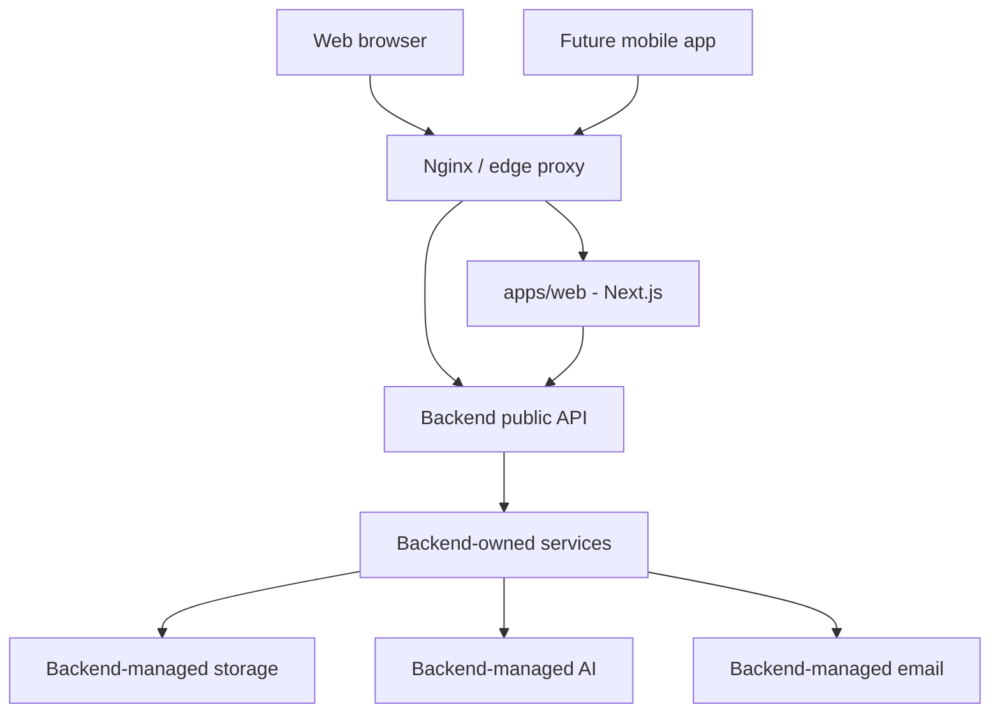

## Monorepo Architecture

Planned structure:

```text
apps/
  web/
packages/
  ui/
  shared/
docs/
```

Frontend-focused planned structure:

```text
apps/web/src/
  app/
  components/
  features/
  lib/api/
  services/
  state/
  mocks/
  types/
packages/
  ui/
  shared/
docs/
```

Sprint 0 intentionally created only folders with real content. Future frontend
packages must be added only when they contain real shared UI, contracts, or
tests. Backend folders and packages should not be created in this workstream
unless the user explicitly changes development responsibility.

Dependency direction:

- Apps may depend on packages.
- Packages must not depend on apps.
- `packages/ui` must stay browser-safe.
- Frontend code must not depend on backend-only packages.
- `packages/shared` may contain public API contracts, frontend-safe domain
  types, and validation schemas for client forms only.
- `packages/shared` must not contain Prisma models, SQL assumptions, backend
  business logic, or backend validation implementations.

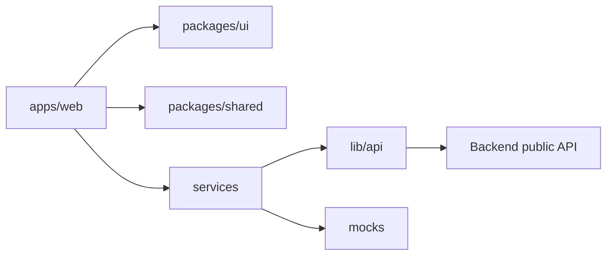

## Frontend Architecture

The web frontend is a Next.js App Router application optimized for a premium,
dark-mode-first creative production workspace.

Responsibilities:

- Every screen, layout, component, interaction, animation, and responsive
  state.
- Routing, layouts, loading states, and error boundaries.
- Authentication screens and session-aware navigation.
- Organization and project workspace UI.
- Client review and approval surfaces.
- Typed API and realtime client integration through service abstractions.
- Local UI state, optimistic interaction state, and view composition.
- Design system consumption from `packages/ui`.
- Loading, empty, error, and success states for every user-facing async flow.
- Frontend notifications and toast surfaces.
- Accessibility and frontend performance.

Non-responsibilities:

- Authoritative permission enforcement.
- Direct database access.
- Direct object storage writes without server-issued upload authorization.
- Business rules that must also be enforced by the API.
- Prisma, SQL, migrations, backend services, backend validation, backend
  deployment, and backend infrastructure.

Frontend layering:

```text
app routes
  -> route-level feature composition
    -> feature components
      -> shared UI primitives
      -> feature services
      -> typed API client / mock service
      -> local state hooks
```

Frontend decisions:

- Use server components where they reduce client bundle size and protect
  server-only concerns.
- Use client components for interactive workspaces, realtime collaboration,
  media review, editors, drag interactions, and local form state.
- Keep API calls behind typed client helpers instead of scattering fetch calls
  through components.
- Keep permissions visible in UI for experience only; hidden UI never replaces
  API authorization.
- Prefer route groups by product area once features exist.
- Keep design tokens, shared controls, and accessible primitives in
  `packages/ui` when they are reused.
- Never fetch directly inside components.
- Keep pages and components unaware of whether data comes from mocks or real
  HTTP requests.
- Separate UI state, server state, form state, authentication state, and
  settings state.
- Build frontend features in this order: design UI, define API contract, create
  mock service, build components, connect components, handle loading, handle
  empty, handle error, handle success, update documentation.

## API Contract and Mock Service Architecture

Frontend development should never pause because backend implementation is not
ready. When a screen needs backend capability, the frontend defines the public
contract and mocks it.

Required contract details:

- HTTP method and route.
- Request params and body.
- Response body.
- Error responses.
- Authorization requirements.
- Validation requirements as public behavior, not backend implementation.
- Expected behavior.

Mock service rules:

- Use realistic mock data.
- Keep mocks behind the same service interface that real API calls will use.
- Simulate loading, empty, error, and success states.
- Keep optimistic updates in service/state boundaries rather than presentation
  components.
- Replace only API/service internals when backend endpoints are available.

Recommended frontend data boundary:

```text
page / feature container
  -> state hook or query adapter
    -> service
      -> lib/api client
      -> mock provider until backend exists
```

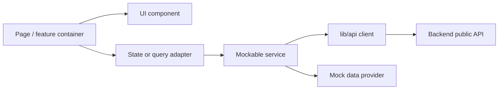

## Backend Architecture

The backend is owned by Developer 2 and must be treated as an external system
from the frontend workstream. The following backend architecture remains a
planning contract only. Frontend code must not import it, mirror it, or depend
on its implementation details.

The planned backend is a NestJS modular monolith.

Responsibilities:

- Authentication and session handling.
- Authorization enforcement.
- REST API endpoints.
- Realtime gateway authorization and event emission.
- Application services for use cases.
- Database access through `packages/database`.
- Object storage coordination.
- AI orchestration and safety boundaries.
- Audit logging.
- Background job dispatch.

Backend layering:

```text
controllers / gateways
  -> guards / interceptors / validation
    -> application services
      -> domain policies and helpers
        -> repositories / Prisma client
          -> PostgreSQL
```

Module boundaries should follow product domains:

- Identity and sessions.
- Organizations and memberships.
- Roles and permissions.
- Clients.
- Projects.
- Tasks and schedules.
- Conversations and notifications.
- Assets, versions, reviews, and approvals.
- Creative production modules.
- AI assistance.
- Audit logs.

Controllers and gateways should stay thin. Application services coordinate use
cases. Domain policy helpers make authorization decisions testable and reusable.

## Database Architecture

PostgreSQL is the authoritative system of record. Prisma is the planned ORM for
schema, migrations, and typed access.

Frontend boundary: database architecture is backend-owned documentation. The
frontend must not import Prisma types, write SQL, model persistence logic, or
make assumptions about tables. Frontend types should represent public API
contracts and UI view models only.

Database principles:

- Organization is the primary tenant boundary.
- Project is the primary work boundary inside an organization.
- Large files are never stored in PostgreSQL.
- Every organization-owned table must include `organization_id` directly or
  inherit it through a required parent relationship.
- Cross-tenant queries must be structurally hard to write by requiring tenant
  scope in repository methods.
- Audit logs should capture sensitive mutations and administrative actions.
- Status values should be explicit enums or constrained values.
- Indexes should follow actual list, lookup, and authorization query patterns.

Core entity groups:

- Identity: users, auth accounts, sessions, verification tokens.
- Tenant structure: organizations, memberships, teams, departments, roles.
- Work structure: clients, projects, project members, project clients.
- Collaboration: tasks, conversations, messages, comments, notifications,
  activity events.
- Creative production: assets, asset versions, approvals, storyboards,
  moodboards, scripts, shot lists, call sheets, equipment, crew, locations.
- Operations: budgets, invoices, contracts.
- Security: audit logs.

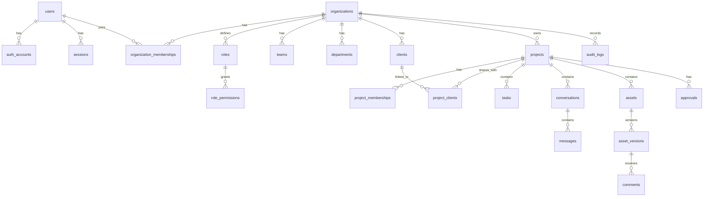

## API Architecture

The primary API is versioned REST over JSON:

```text
/api/v1/...
```

API principles:

- Request and response contracts must be typed and validated.
- Every endpoint must document authentication, permissions, request, response,
  errors, and examples before or with implementation.
- Organization-scoped resources should use organization context in the route or
  resolved authenticated context.
- Nested routes are used when the parent context is required for authorization
  or clarity.
- Errors use a consistent safe response shape.
- Cursor pagination is preferred for large lists and activity feeds.
- Mutations that affect collaboration state may emit realtime events after the
  database transaction commits.
- Internal service APIs are not public API contracts.
- Frontend work defines public contracts and consumes them through `lib/api/*`
  and service abstractions.
- Components never call `fetch` directly.
- Mock services are valid frontend infrastructure until the backend implements
  the documented contract.

Baseline route shape:

```text
POST /api/v1/auth/login
GET  /api/v1/auth/me
GET  /api/v1/organizations
POST /api/v1/organizations
GET  /api/v1/organizations/:organizationId/projects
POST /api/v1/organizations/:organizationId/projects
GET  /api/v1/projects/:projectId
GET  /api/v1/projects/:projectId/assets
```

Response envelope:

```json
{
  "data": {}
}
```

Error envelope:

```json
{
  "error": {
    "code": "forbidden",
    "message": "You do not have permission to perform this action.",
    "requestId": "req_example"
  }
}
```

## Authentication Flow

Authentication identifies the user and session. Authorization decides what that
identity may do.

Chosen model:

- Email authentication first.
- OAuth-ready account records.
- Short-lived JWT access tokens.
- Rotated opaque refresh tokens stored server-side as hashes.
- Server-side session revocation.
- Organization-aware active context.

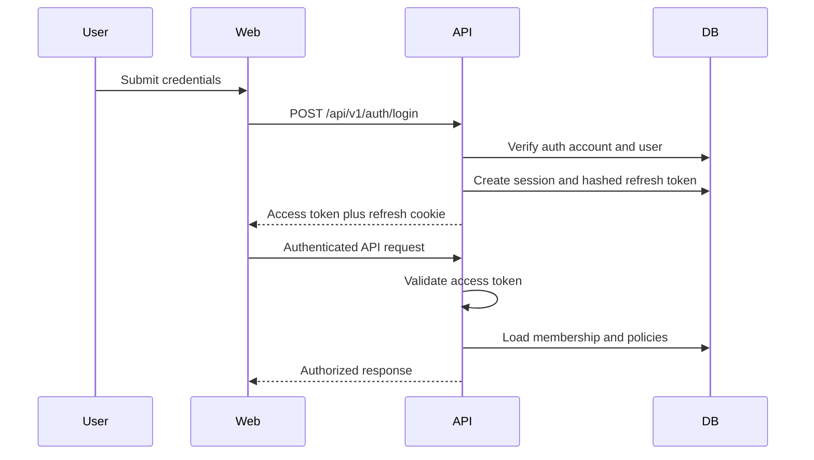

Refresh flow:

1. Client sends refresh token through the approved web session mechanism.
2. API hashes the presented token and looks up the active session.
3. API rotates the refresh token and invalidates the previous token.
4. API issues a new short-lived access token.
5. Suspicious reuse revokes the affected session family and records an audit
   event.

## Authorization Model

Fylmico uses hybrid RBAC plus policy checks.

Authorization order:

1. Require authentication unless the route is explicitly public.
2. Resolve active organization.
3. Verify organization membership.
4. Check role-granted permissions.
5. Evaluate resource policy: project membership, client sharing, ownership,
   workflow state, visibility, and record sensitivity.
6. Log important denials, administrative changes, and sensitive mutations.

Permission naming:

```text
resource.action
```

Examples:

- `organization.read`
- `member.invite`
- `project.create`
- `project.update`
- `asset.upload`
- `asset.review`
- `comment.create`
- `approval.create`
- `billing.manage`
- `audit.read`

The API is the enforcement source. UI permission checks exist to avoid showing
unavailable actions, but they are not security controls.

## Organization Hierarchy

Organization is the tenant boundary and top-level workspace.

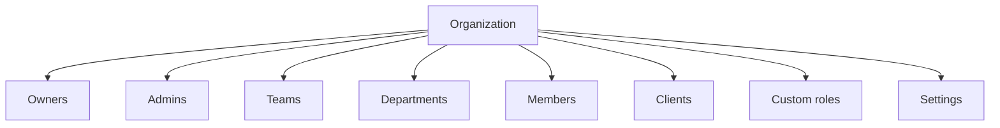

Hierarchy rules:

- A user may belong to many organizations.
- A membership belongs to exactly one organization and one user.
- Owners control organization lifecycle and billing-sensitive settings.
- Admins manage members, settings, and most organization resources.
- Managers coordinate teams, departments, and projects.
- Members work inside assigned or visible project areas.
- Clients are organization members or external identities with explicitly
  shared access.
- Platform admin is a system role and must not replace normal organization
  permissions.

## Project Hierarchy

Project is the primary production workspace inside an organization.

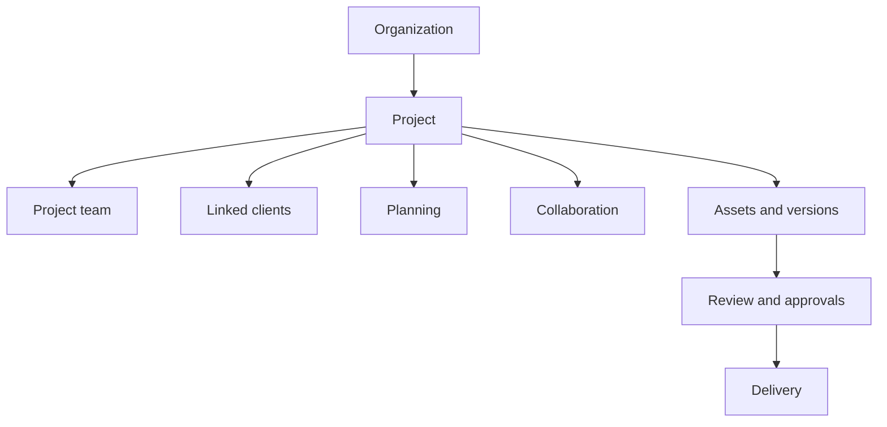

Project rules:

- Every project belongs to one organization.
- Projects may link to one or more clients.
- Project membership can narrow or expand access beyond organization role.
- Production modules should attach to projects unless they are organization
  templates or shared resources.
- Client visibility is explicit and must not expose internal-only resources.
- Archiving a project hides it from active workflows but preserves audit and
  historical records.

## File Storage Architecture

Binary files live in object storage. PostgreSQL stores metadata, ownership,
permissions, version history, processing state, and object keys.

Storage principles:

- Store originals, versions, thumbnails, previews, transcodes, exports, and AI
  derived artifacts as separate objects.
- Use server-issued signed upload and download URLs.
- Scope object keys by environment, organization, project, asset, and version.
- Keep access checks in the API before issuing signed URLs.
- Do not expose raw bucket structure as a stable public contract.
- Process media asynchronously once a worker exists.
- Preserve version history for review and approval workflows.

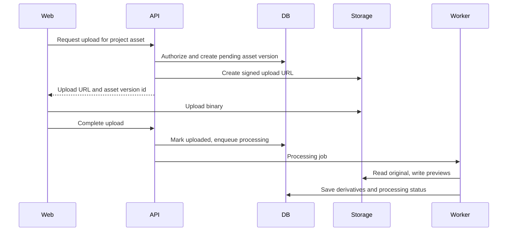

## Realtime Architecture

Socket.IO is the accepted realtime transport.

Frontend boundary: realtime integration must use documented public event
contracts only. Frontend code must not depend on backend room implementation,
adapter details, Redis, or gateway internals.

Realtime principles:

- Events are typed in `packages/realtime`.
- Room names are generated by shared helpers.
- Room joins are authorized server-side.
- Realtime events are hints and updates, not the source of truth.
- Persisted state changes must be committed before events are emitted.
- Clients must be able to recover by refetching authoritative API state.

Room scopes:

- `user:{userId}:notifications`
- `organization:{organizationId}`
- `project:{projectId}`
- `conversation:{conversationId}`
- `asset-review:{assetVersionId}`

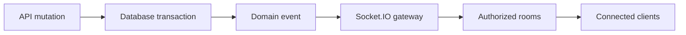

## AI Integration Architecture

AI is an application service capability, not an autonomous data owner.

Frontend boundary: AI services are backend-owned. Frontend work may define the
public request/response contract and mock responses, but must not call AI
providers directly or embed provider-specific prompt orchestration in UI code.

AI responsibilities:

- Assist with production planning, summaries, briefs, scripts, shot lists,
  review summaries, task extraction, and search enhancement.
- Use only data the requesting user is authorized to access.
- Return suggestions that users can accept, edit, or discard.
- Record AI-assisted mutations as user-approved actions.

AI boundaries:

- The database remains authoritative.
- AI providers do not receive raw tenant data unless the use case, user action,
  and provider policy allow it.
- Prompt construction must include permission filtering, data minimization, and
  audit metadata.
- AI output that changes project state requires normal API authorization.
- Provider-specific logic belongs behind `packages/ai` and backend services so
  the product can switch providers later.

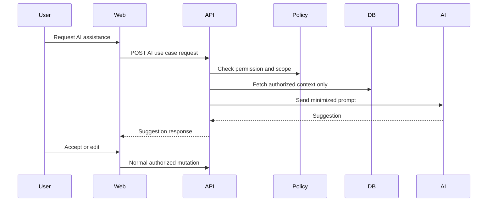

## Future Mobile Application Compatibility

Future mobile clients should consume the same API, auth model, authorization
rules, realtime contracts, and file access model as the web app.

Compatibility requirements:

- Keep API contracts transport-neutral and avoid web-only assumptions.
- Use token/session design that can support secure mobile storage.
- Avoid coupling core workflows to browser-only APIs.
- Keep realtime event payloads small and resumable.
- Support cursor pagination and offline-friendly sync windows for mobile lists.
- Keep object storage access behind short-lived signed URLs.
- Version API contracts before mobile release.
- Design notification events so they can map to push notifications later.

Mobile should not require a separate backend. If a mobile-specific gateway is
needed later, it should compose existing application services instead of
duplicating business rules.

## Deployment Architecture

Initial deployment target:

- Hostinger VPS.
- Dockerized services.
- Nginx reverse proxy.
- PostgreSQL managed or containerized depending on operational constraints.
- GitHub for source control and future automation.

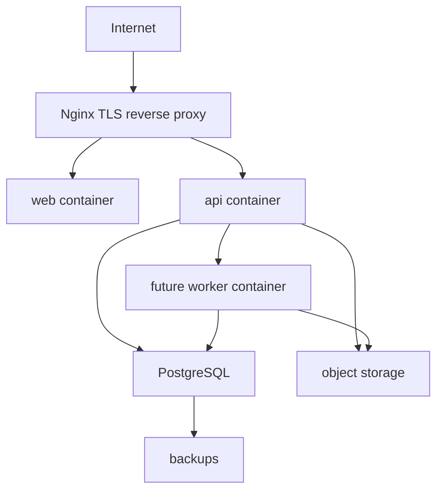

Deployment requirements before production launch:

- Document environment variables.
- Document migration procedure.
- Require database backup before risky migrations.
- Define rollback procedure.
- Configure TLS, security headers, and CORS.
- Configure logs, monitoring, and alerts.
- Define backup retention and restore tests.

Sprint 0 also supports Hostinger static deployment for the current web shell via
`npm run build:hostinger`, but the long-term production architecture is the
Dockerized web/API/database topology.

## Scaling Strategy

Phase 1: single-node modular monolith.

- One web runtime.
- One API runtime.
- PostgreSQL.
- Nginx.
- Local or external object storage once file features begin.

Phase 2: add operational services.

- Add background worker for media processing, email, notifications, and AI jobs.
- Add Redis for queues, rate limiting, caching, and Socket.IO adapter.
- Add object storage and CDN.
- Add observability.

Phase 3: scale horizontally.

- Run multiple API instances behind Nginx or a load balancer.
- Use Redis Socket.IO adapter for realtime fanout.
- Move CPU-heavy media processing to separate workers.
- Add read replicas only when query patterns justify them.
- Add dedicated search infrastructure when PostgreSQL search is insufficient.

Phase 4: extract services selectively.

- Extract media processing, search, notifications, or AI orchestration only when
  metrics and operational pressure justify it.
- Keep shared contracts and authorization policies consistent during extraction.

Scaling rules:

- Scale the database carefully before splitting services.
- Measure before extracting.
- Preserve tenant isolation in every cache, queue, index, and realtime channel.
- Keep recovery paths and observability ahead of traffic growth.

## Required ADR Coverage

Accepted:

- ADR 0001: Monorepo structure.
- ADR 0002: Database and ORM.
- ADR 0003: Authentication model.
- ADR 0004: Permissions model.
- ADR 0005: Realtime architecture.
- ADR 0006: Deployment architecture.
- ADR 0007: Sprint 0 foundation scaffold.
- ADR 0008: Modular monolith backend.
- ADR 0009: Frontend architecture.
- ADR 0010: API architecture.
- ADR 0011: Organization hierarchy.
- ADR 0012: Project hierarchy.
- ADR 0013: File storage architecture.
- ADR 0014: AI integration architecture.
- ADR 0015: Future mobile compatibility.
- ADR 0016: Scaling strategy.
- ADR 0017: Frontend and backend independence.

Future ADRs:

- Package manager and build tooling beyond npm workspaces.
- Validation library.
- Object storage provider.
- Background job system.
- Search infrastructure.
- Email provider.
- Observability provider.
- Mobile app technology choice.
