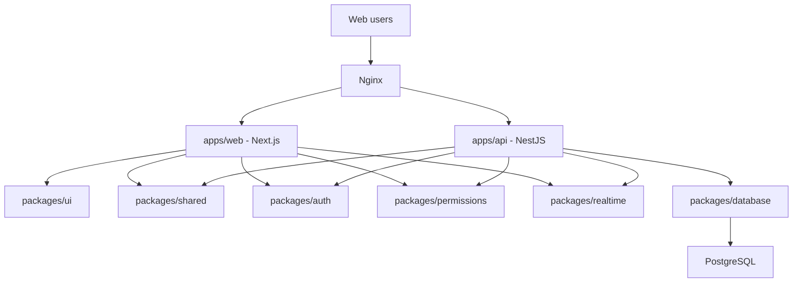

# Architecture

## Status

Accepted planning baseline. No application code has been created.

## Architecture Goals

- Support a long-lived creative production platform.
- Keep web, API, shared packages, and documentation organized in a scalable
  monorepo.
- Make organization tenancy explicit from the first schema and API design.
- Keep domain modules reusable, strongly typed, and testable.
- Avoid placeholder implementations and duplicated logic.
- Make major decisions traceable through ADRs.

## Architecture Style

Fylmico will use a modular monorepo with clean architecture principles:

- Domain logic should not depend on framework details.
- API controllers should stay thin.
- Application services should coordinate use cases.
- Shared contracts should live in packages.
- Infrastructure concerns should be isolated.
- Authorization should be centralized and testable.

## Planned Monorepo Structure

```text
apps/
  web/
  api/
packages/
  ui/
  database/
  auth/
  shared/
  realtime/
  notifications/
  calendar/
  storyboard/
  editor/
  permissions/
  search/
  ai/
docs/
```

## System Diagram



## Applications

### `apps/web`

Next.js application for the Fylmico web product.

Responsibilities:

- Product UI.
- Routing and layouts.
- Authentication screens.
- Organization and project workflows.
- Client-facing review experiences.
- Consumption of typed API and realtime contracts.

Non-responsibilities:

- Authoritative permission enforcement.
- Direct database access.
- Business rules that must also run server-side.

### `apps/api`

NestJS application for HTTP API, realtime gateways, and server-side domain
services.

Responsibilities:

- Authentication and session handling.
- Authorization enforcement.
- API endpoints.
- Realtime room authorization and event emission.
- Domain services.
- Database access through `packages/database`.
- Audit logging.

## Packages

### `packages/ui`

Shared UI components, design tokens, and frontend primitives.

### `packages/database`

Prisma schema, migrations, database client, and database-related types.

### `packages/auth`

Authentication contracts, token claim types, and auth helper utilities.

### `packages/permissions`

Role definitions, permission names, policy helpers, and authorization tests.

### `packages/realtime`

Typed Socket.IO event names, payload schemas, room naming helpers, and realtime
contracts.

### `packages/shared`

Shared TypeScript types, constants, validation schemas, and domain contracts
that are genuinely used by more than one app or package.

### Domain Packages

The following packages are planned but should be created only when needed:

- `packages/notifications`
- `packages/calendar`
- `packages/storyboard`
- `packages/editor`
- `packages/search`
- `packages/ai`

## Service Boundaries

Initial deployment is a modular monolith API, not microservices. This keeps
early development coherent while preserving package boundaries for future
extraction if the product grows.

Initial runtime services:

- Web app.
- API app.
- PostgreSQL database.
- Nginx reverse proxy.

Future runtime services may include:

- Background worker.
- Search service.
- Object storage.
- Media processing worker.
- Realtime adapter service such as Redis.

## Dependency Rules

- `apps/web` may depend on `packages/ui`, `packages/shared`,
  `packages/auth`, `packages/permissions`, and `packages/realtime`.
- `apps/api` may depend on all shared packages, including
  `packages/database`.
- `packages/ui` must not depend on server-only packages.
- `packages/database` must not depend on app code.
- `packages/shared` must stay lightweight and must not become a dumping ground.
- Domain packages must not create circular dependencies.

## Authentication

Authentication uses email auth and OAuth-ready account records, short-lived JWT
access tokens, and rotated opaque refresh tokens stored server-side as hashes.
See `docs/authentication.md` and ADR 0003.

## Authorization

Authorization uses hybrid RBAC and policy checks. The API is the enforcement
source. UI checks are only for experience. See `docs/permissions.md` and ADR 0004.

## Realtime

Socket.IO is the accepted realtime transport. Events must be typed and
permission-aware. Room joins must be authorized server-side. See ADR 0005.

## Scaling Strategy

Phase 1:

- Single web app.
- Single API app.
- PostgreSQL.
- Nginx.

Phase 2:

- Add background worker when async jobs are needed.
- Add object storage for assets.
- Add Redis or another adapter when realtime needs multi-instance delivery.

Phase 3:

- Split high-load services only when operational metrics justify it.
- Add dedicated search infrastructure when database-backed search becomes
  insufficient.
- Add media processing services for video workflows.

## Required ADR Coverage

Accepted:

- ADR 0001: Monorepo structure.
- ADR 0002: Database and ORM.
- ADR 0003: Authentication model.
- ADR 0004: Permissions model.
- ADR 0005: Realtime architecture.
- ADR 0006: Deployment architecture.

Future ADRs:

- Package manager and build tooling.
- Object storage.
- Background jobs.
- Search infrastructure.
- Email provider.
- Observability provider.
