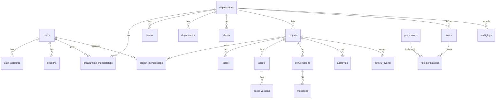

# Database

## Status

Accepted planning baseline. The identity table group (`users`, `auth_accounts`,
`sessions`, `email_verification_tokens`, `password_reset_tokens`) is
implemented per ADR 0019; the `organizations`/`roles`/
`organization_memberships` subset of the "Organizations and access" group is
implemented per ADR 0020; `tasks`/`conversations`/`messages` (a simplified,
single-assignee/no-membership-table version of the planned Collaboration
group) are implemented per ADR 0021; and `projects`/`clients`/
`project_clients` (the "Production structure" group, minus `teams`/
`departments`) are implemented per ADR 0022; `notifications` (from the
Collaboration group) is implemented per ADR 0023; and `comments` (from the
Creative production group, scoped to tasks/projects only) is implemented
per ADR 0024 — see "Implemented Tables" below. `permissions`/
`role_permissions`/`project_memberships`, `task_assignees`/
`conversation_members`, `teams`/`departments`, `activity_events`, and all
other groups remain planning only.

## Database Stack

- PostgreSQL
- Prisma ORM

See ADR 0002.

## Database Design Principles

- Organization is the primary tenant boundary.
- Organization-owned records must include `organization_id` directly or through
  a required parent relationship.
- Use relational structure when relationships are known.
- Use constraints to protect data integrity.
- Use indexes based on expected query patterns.
- Store large media files outside PostgreSQL and keep metadata plus object
  references in the database.
- Document every migration.
- Do not add tables without documenting ownership, relationships, permissions,
  and indexes.

## Core Entity Groups

Identity:

- `users`
- `auth_accounts`
- `sessions`
- `email_verification_tokens`
- `password_reset_tokens`

Organizations and access:

- `organizations`
- `organization_memberships`
- `roles`
- `permissions`
- `role_permissions`
- `project_memberships`

Production structure:

- `teams`
- `departments`
- `clients`
- `projects`
- `project_clients`

Collaboration:

- `tasks`
- `task_assignees`
- `conversations`
- `conversation_members`
- `messages`
- `notifications`
- `activity_events`

Creative production:

- `assets`
- `asset_versions`
- `comments`
- `approvals`
- `storyboards`
- `moodboards`
- `scripts`
- `shot_lists`
- `call_sheets`
- `equipment`
- `crew_members`
- `locations`

Business operations:

- `budgets`
- `invoices`
- `contracts`

Security and audit:

- `audit_logs`

## Initial Relationship Model

- A `user` can have many `auth_accounts`.
- A `user` can have many `sessions`.
- An `organization` has many `organization_memberships`.
- A `user` joins an `organization` through `organization_memberships`.
- An `organization` has many `teams`, `departments`, `clients`, and `projects`.
- A `project` belongs to one `organization`.
- A `project` can be linked to many `clients`.
- A `project` has many tasks, assets, conversations, comments, approvals, and
  activity events.
- An `asset` belongs to an organization and usually to a project.
- An `asset` has many `asset_versions`.
- A `comment` belongs to a target such as an asset version, task, or project
  discussion.
- An `approval` belongs to a target and records who requested and granted the
  approval.
- An `audit_log` belongs to an organization and records important actions.

## Baseline ER Diagram

## Required Base Columns

Most tables should include:

- `id`
- `created_at`
- `updated_at`

Organization-owned tables should include:

- `organization_id`

Soft deletion should be used only when product, audit, or recovery needs justify
it. If used, document the reason and include:

- `deleted_at`
- `deleted_by_user_id`

## Index Strategy

Expected indexes:

- Foreign keys.
- `organization_id` on tenant-scoped tables.
- Compound indexes for common organization/project queries.
- Unique constraints scoped by organization where names or slugs are local to an
  organization.
- Token lookup hashes for authentication token tables.
- Created-at indexes for audit logs, activity events, messages, and
  notifications.

## Constraints

Expected constraints:

- Required foreign keys for ownership boundaries.
- Unique email normalization for users or auth identities.
- Unique organization membership per user and organization.
- Unique role names within organization scope where custom roles exist.
- Valid enum values for statuses.
- Non-null status fields for workflow entities.

## Migration History

- `20260708161817_init_identity` — identity tables (ADR 0019).
- `20260708164132_organizations_houses` — organizations/roles/memberships,
  plus `users.name`/`users.active_organization_id` (ADR 0020).
- `20260708165828_tasks_chat` — tasks/conversations/messages (ADR 0021).
- `20260708172602_projects_clients` — projects/clients/project_clients
  (ADR 0022).
- `20260708173903_notifications` — notifications (ADR 0023).
- `20260708211532_comments` — comments (ADR 0024).

Per-table detail is in each table's own "Migration history" line below.

## Implemented Tables

### Table: `users`

Purpose: represents a person, independent of how they authenticate.

Ownership: none (not organization-scoped; a user can belong to many
organizations via `organization_memberships`).

Columns: `id` (cuid), `email` (unique, normalized lowercase), `name`
(required, collected at signup, added per ADR 0020 once the houses feature
needed a display name), `email_verified_at` (nullable),
`active_organization_id` (nullable, added per ADR 0020 — the house the user
most recently created/joined; no house-switcher UI exists yet to make this a
real choice), `created_at`, `updated_at`.

Relationships: has many `auth_accounts`, `sessions`, `email_verification_tokens`,
`password_reset_tokens`, `organization_memberships`.

Indexes: unique index on `email`.

Constraints: `email` unique; `name` non-null.

Permissions: a user may only read/update their own record via `/api/v1/auth/me`
(no admin/user-management endpoints exist yet).

Reasoning: kept separate from `auth_accounts` so a user can have multiple login
methods (email now, OAuth later) without changing this table.
`active_organization_id` is a plain nullable column rather than a separate
table since only one "currently active" house per user is meaningful right
now (no concept of per-device or per-session active house).

Migration history: `20260708161817_init_identity` (initial columns);
`name`/`active_organization_id` added in `20260708164132_organizations_houses`.

### Table: `auth_accounts`

Purpose: represents a login method for a user (email+password today; OAuth
providers later reuse this table).

Ownership: belongs to one `user`.

Columns: `id`, `user_id`, `provider` (e.g. `"email"`), `provider_account_id`
(normalized email for the `email` provider), `password_hash` (nullable — only
set for the `email` provider), `created_at`, `updated_at`.

Relationships: belongs to `users` (cascade delete).

Indexes: unique compound index on `(provider, provider_account_id)`; index on
`user_id`.

Constraints: `(provider, provider_account_id)` unique — enforces one email
account per address.

Permissions: managed only through auth endpoints (signup, login, reset-password);
never exposed directly.

Reasoning: separating login methods from `users` is what lets OAuth get added
later (ADR 0003) without a `users` schema change.

Migration history: `20260708161817_init_identity`.

### Table: `sessions`

Purpose: represents an active authenticated session (one per issued
refresh-token lineage).

Ownership: belongs to one `user`.

Columns: `id`, `user_id`, `refresh_token_hash` (unique, sha256 of the opaque
refresh token — never the plaintext token), `user_agent` (nullable),
`ip_address` (nullable), `expires_at`, `revoked_at` (nullable), `created_at`.

Relationships: belongs to `users` (cascade delete).

Indexes: unique index on `refresh_token_hash` (this is also the lookup path
for `/api/v1/auth/refresh`); index on `user_id`.

Constraints: `refresh_token_hash` unique.

Permissions: a session can only be revoked by its owning user, via
`/api/v1/auth/logout` (current session) or `/api/v1/auth/logout-all` (all
sessions).

Reasoning: refresh tokens are rotated in place on each `/api/v1/auth/refresh`
call by updating this row's `refresh_token_hash`/`expires_at` rather than
creating a new row per rotation, per ADR 0019.

Migration history: `20260708161817_init_identity`.

### Table: `email_verification_tokens`

Purpose: single-use tokens proving control of an email address.

Ownership: belongs to one `user`.

Columns: `id`, `user_id`, `token_hash` (unique, sha256 of the opaque token),
`expires_at`, `consumed_at` (nullable), `created_at`.

Relationships: belongs to `users` (cascade delete).

Indexes: unique index on `token_hash`; index on `user_id`.

Constraints: `token_hash` unique.

Permissions: consumed only via `/api/v1/auth/verify-email`; never listed or
exposed otherwise.

Reasoning: no email provider is chosen yet (ADR 0019), so the plaintext token
is logged server-side rather than emailed — a temporary stand-in, not the
final delivery mechanism.

Migration history: `20260708161817_init_identity`.

### Table: `password_reset_tokens`

Purpose: single-use tokens authorizing a password reset.

Ownership: belongs to one `user`.

Columns: `id`, `user_id`, `token_hash` (unique, sha256 of the opaque token),
`expires_at`, `consumed_at` (nullable), `created_at`.

Relationships: belongs to `users` (cascade delete).

Indexes: unique index on `token_hash`; index on `user_id`.

Constraints: `token_hash` unique.

Permissions: consumed only via `/api/v1/auth/reset-password`;
`/api/v1/auth/request-password-reset` always responds identically whether or
not the email is registered, to avoid leaking account existence.

Reasoning: successfully resetting a password also revokes all of that user's
existing sessions (ADR 0019), since a reset implies the old password (and any
session established under it) should no longer be trusted.

Migration history: `20260708161817_init_identity`.

### Table: `organizations`

Purpose: the tenant boundary (ADR 0011), product-facing as a "House."

Ownership: none (top-level; owns `roles` and `organization_memberships`).

Columns: `id`, `name`, `handle` (unique, lowercase URL-safe), `description`,
`invite_code` (unique, format `{HANDLE_PREFIX}-{4 digits}`), `created_at`,
`updated_at`.

Relationships: has many `roles`, `organization_memberships`.

Indexes: unique indexes on `handle` and `invite_code`.

Constraints: `handle` and `invite_code` unique.

Permissions: created by any authenticated user
(`POST /api/v1/houses`); joined via `invite_code`
(`POST /api/v1/houses/join`). No update/delete endpoint exists yet.

Reasoning: `invite_code` is a single code per organization (not per role) in
this pass — see ADR 0020 for why joining defaults to a generic `"Member"`
role rather than a role the invite code itself specifies.

Migration history: `20260708164132_organizations_houses`.

### Table: `roles`

Purpose: an organization-scoped label (name/color/description) — "who has
which crew role" in the UI. Does not yet carry granular permission grants
(see ADR 0020/0004 — `permissions`/`role_permissions` are deferred).

Ownership: belongs to one `organization`.

Columns: `id`, `organization_id`, `name`, `color`, `description`, `created_at`.

Relationships: belongs to `organizations` (cascade delete); has many
`organization_memberships`.

Indexes: unique compound index on `(organization_id, name)`; index on
`organization_id`.

Constraints: `(organization_id, name)` unique — role names are unique within
a house, not globally.

Permissions: the 5 default roles (Owner/Producer/Editor/Videographer/
Photographer) are seeded automatically at house creation; `"Member"` is
seeded lazily on first invite-code join. No endpoint to create/edit custom
roles exists yet.

Reasoning: seeded role names/colors/descriptions match
`apps/web/src/services/base-workspace.service.ts`'s `defaultRoles` exactly,
so the real API's house-creation response is indistinguishable in shape from
what the frontend's mock already returns.

Migration history: `20260708164132_organizations_houses`.

### Table: `organization_memberships`

Purpose: links a user to an organization with a role — the actual
"membership" record.

Ownership: belongs to one `organization` and one `user`.

Columns: `id`, `organization_id`, `user_id`, `role_id`, `created_at`.

Relationships: belongs to `organizations` and `users` (both cascade delete);
belongs to `roles` (no cascade — a role should not disappear out from under
a membership; roles aren't deletable via any endpoint yet anyway).

Indexes: unique compound index on `(organization_id, user_id)`; indexes on
`organization_id` and `user_id`.

Constraints: `(organization_id, user_id)` unique — one membership per user
per house, matching ADR 0011's model.

Permissions: created by house creation (creator, `"Owner"` role) or
`POST /api/v1/houses/join` (joiner, `"Member"` role). No endpoint to change
a member's role or remove a member exists yet.

Reasoning: `HouseMember.status` (online/away/offline) in the API response is
computed at read time (`"online"` for the requesting user, `"offline"` for
everyone else), not stored here — real presence belongs to the realtime
system (ADR 0005), not this table.

Migration history: `20260708164132_organizations_houses`.

### Table: `tasks`

Purpose: a single production task scheduled and assigned within a house.

Ownership: belongs to one `organization`.

Columns: `id`, `organization_id`, `title`, `project` (plain string label, not
a foreign key - even though a real `projects` table exists as of ADR 0022,
a task's `project` is still freeform text, not a `project_id` FK; see
Reasoning below), `assignee_id`, `role` (plain string, auto-derived from the
assignee's current `roles.name` at create/reassign time as of ADR 0026 - not
a DB foreign key, and no longer a client-supplied field), `due_date` (plain
string, not a real `DATE`/`TIMESTAMP` - the frontend only ever displays it,
never computes against it), `status` (default `"todo"` as of ADR 0026;
`"todo" | "in-progress" | "on-hold" | "done"`, the same vocabulary the
dashboard's task panel and the standalone Tasks page both use), `priority`
(default `"medium"`; `"low" | "medium" | "high"`), `created_at`, `updated_at`.

Relationships: belongs to `organizations` (cascade delete); belongs to
`users` via `assignee_id` (no cascade - a task shouldn't vanish if its
assignee's account is later deleted; that's an unhandled edge case to
revisit if user deletion is ever implemented).

Indexes: indexes on `organization_id` and `assignee_id`.

Constraints: none beyond required foreign keys.

Permissions: create/update/delete via `POST` / `PATCH` / `DELETE
/api/v1/tasks(/:taskId)` by any member of the task's house (ADR 0021 and
0026 - no finer-grained role check yet).

Reasoning: single `assignee_id` rather than a `task_assignees` join table -
matches what `docs/api.md`'s contract and the mock actually need
(one assignee per task); a many-to-many upgrade is deferred until a real
multi-assignee feature exists (ADR 0021). `project` stays freeform text
rather than becoming a `project_id` FK (ADR 0026) - the Tasks page lets
someone type an ad-hoc project label when creating a task without first
having to create a real `Project` row; linking the two is future work once
task creation flows through a project-picker instead of free text.

Migration history: `20260708165828_tasks_chat`, `20260710170043_task_status_default_todo`.

### Table: `conversations`

Purpose: a named, house-wide chat channel (product-facing as part of a
"House" - not a private/DM thread; see `messages` below for why).

Ownership: belongs to one `organization`.

Columns: `id`, `organization_id`, `name`, `topic`, `created_at`.

Relationships: belongs to `organizations` (cascade delete); has many
`messages`.

Indexes: unique compound index on `(organization_id, name)`; index on
`organization_id`.

Constraints: `(organization_id, name)` unique - channel names are unique
within a house.

Permissions: 3 default conversations (`"general"`, `"edit-bay"`,
`"shoot-floor"`) are seeded automatically at house creation, matching the
mock's `defaultChatRooms`. No endpoint to create custom rooms exists yet.
Every house member can see and post to every conversation in their house -
there is no `conversation_members` table yet, so there's no concept of a
private/restricted room.

Reasoning: named "conversations" (matching `docs/database.md`'s original
Collaboration group naming) rather than a new "chat_rooms" table, even
though the frontend/API vocabulary is "ChatRoom" - same
Organization-is-House-at-the-API-layer mapping pattern as ADR 0018/0020,
so the eventual `conversation_members` table (for private/DM threads) can
be added later without a rename.

Migration history: `20260708165828_tasks_chat`.

### Table: `messages`

Purpose: a single chat message within a conversation.

Ownership: belongs to one `conversation`.

Columns: `id`, `conversation_id`, `author_id`, `body`, `created_at`.

Relationships: belongs to `conversations` (cascade delete); belongs to
`users` via `author_id` (no cascade, same reasoning as `tasks.assignee_id`).

Indexes: indexes on `conversation_id` and `author_id`.

Constraints: none beyond required foreign keys.

Permissions: created via
`POST /api/v1/chat/rooms/:roomId/messages` by any member of the room's
house (ADR 0021). No edit/delete endpoint exists yet.

Reasoning: `unreadCount` in the API response is always `0` - read-tracking
is a real feature (or realtime-adjacent, ADR 0005), not modeled by this
table.

Migration history: `20260708165828_tasks_chat`.

### Table: `projects`

Purpose: the primary production workspace inside a house (ADR 0012) — later
modules (assets, schedules, storyboards) will attach to this.

Ownership: belongs to one `organization`.

Columns: `id`, `organization_id`, `name`, `description` (nullable), `type`
(nullable; one of a fixed production-type list validated at the service
layer, e.g. `"Short Film"`, `"Documentary"`), `genre` (nullable freeform
string), `stage` (default `"Development"`; one of `"Development" |
"Pre-Production" | "In Production" | "In Progress" | "Post-Production" |
"On Hold" | "Completed"` - as of ADR 0027), `progress` (`Int`, default `0`,
0-100), `cover_gradient` (nullable, a Tailwind gradient class string),
`cover_icon` (nullable; one of a fixed icon-key list, e.g. `"camera"`,
mapped to a Lucide icon component client-side), `due_date` (nullable
freeform string - same non-real-date choice as `tasks.due_date`),
`team_ids` (`String[]`, Postgres native array of `users.id` values),
`status` (`"active"` | `"archived"`, default `"active"` - archive tracking
only, distinct from the display-facing status derived from `stage`),
`created_at`, `updated_at`.

Relationships: belongs to `organizations` (cascade delete); has many
`project_clients` (linking to `clients`). `team_ids` is **not** a foreign
key or join table - it's a plain array of user ids, validated at the
service layer (every id must be a current member of the project's house)
but with no DB-level referential integrity, so a removed member's id can
silently linger in a project's `team_ids` until the project is next
updated.

Indexes: index on `organization_id`.

Constraints: none beyond required foreign keys - project names are not
unique within a house.

Permissions: created/read/updated/archived via `/api/v1/houses/:houseId/projects`
and `/api/v1/projects/:projectId` routes by any member of the house (ADR
0022 - no project-level membership/visibility restriction yet).

Reasoning: `status` is a plain string rather than an enum type, matching
the same choice made for `tasks.status`/`tasks.priority` - archiving is
modeled as a status value, set via a dedicated
`POST /api/v1/projects/:projectId/archive` action endpoint rather than a
generic `PATCH`. As of ADR 0027, the API's response `status` field is
**not** this column's value - it's computed server-side from `stage` (a
`Development|Pre-Production|In Production -> active`,
`In Progress|Post-Production -> in-progress`, `On Hold -> on-hold`,
`Completed -> completed` mapping) to match the frontend's designed status
vocabulary, while the DB column continues tracking archive state
separately. No `image`/cover-photo upload field exists - no object storage
system exists yet anywhere in the backend, so new projects fall back to
`cover_gradient`/`cover_icon` only.

Migration history: `20260708172602_projects_clients`,
`20260710172256_project_designed_ui_fields`.

### Table: `clients`

Purpose: an external client that can be linked to one or more projects
(ADR 0012).

Ownership: belongs to one `organization`.

Columns: `id`, `organization_id`, `name`, `contact_name` (nullable),
`contact_email` (nullable), `created_at`, `updated_at`.

Relationships: belongs to `organizations` (cascade delete); has many
`project_clients` (linking to `projects`).

Indexes: index on `organization_id`.

Constraints: none beyond required foreign keys - client names are not
unique within a house.

Permissions: created/read/updated via `/api/v1/houses/:houseId/clients`
and `/api/v1/clients/:clientId` routes by any member of the house (ADR
0022).

Reasoning: kept intentionally minimal (no address, billing, or portal
fields) - only what a project needs to display/link a client right now;
extend when a real feature needs more.

Migration history: `20260708172602_projects_clients`.

### Table: `project_clients`

Purpose: many-to-many link between `projects` and `clients` (ADR 0012: "a
project can be linked to many clients").

Ownership: belongs to one `project` and one `client` (both within the same
house - enforced at the service layer, not a DB constraint, since a
project's and a client's `organization_id` living on different rows can't
be compared by a single foreign key or check constraint without a trigger).

Columns: `id`, `project_id`, `client_id`, `created_at`.

Relationships: belongs to `projects` and `clients` (both cascade delete).

Indexes: unique compound index on `(project_id, client_id)`; indexes on
`project_id` and `client_id`.

Constraints: `(project_id, client_id)` unique - a client can only be linked
to the same project once.

Permissions: created via `POST /api/v1/projects/:projectId/clients` by any
member of the project's house. No unlink endpoint exists yet (ADR 0022).

Reasoning: a plain join table with no extra columns - there's no "role of
this client on this project" concept yet, just presence/absence of a link.

Migration history: `20260708172602_projects_clients`.

### Table: `notifications`

Purpose: a message to a user about something that happened (task assigned,
house joined). No realtime delivery yet (ADR 0005 not implemented) - a
client must poll `GET /api/v1/notifications` to see new ones.

Ownership: belongs to one `user` (the recipient).

Columns: `id`, `user_id`, `type` (plain string, e.g. `"task_assigned"`,
`"house_joined"`), `title`, `body`, `read_at` (nullable), `created_at`.

Relationships: belongs to `users` (cascade delete).

Indexes: index on `user_id`.

Constraints: none beyond required foreign keys.

Permissions: created only server-side (no public create endpoint) by
`TasksService.createTask` (notifies the assignee) and
`OrganizationsService.joinHouse` (notifies the house's `"Owner"`
member(s)). Read/marked-read only by the owning user
(`GET /api/v1/notifications`, `POST /api/v1/notifications/:id/read`,
`POST /api/v1/notifications/read-all`).

Reasoning: no polymorphic "related entity" reference (no `relatedType`/
`relatedId`) - notifications don't need `comments`' `commentableType`/
`commentableId` pattern (below) since nothing yet needs to deep-link a
notification back to its source record, just show a message (ADR 0023).

Migration history: `20260708173903_notifications`.

### Table: `comments`

Purpose: a comment on a task or project - resolves the "comment target
modeling strategy" deferred decision (ADR 0024).

Ownership: belongs to one `organization` (denormalized from the target,
matching `tasks`/`messages`' pattern) and one `user` (the author).

Columns: `id`, `organization_id`, `commentable_type` (`"task"` |
`"project"`), `commentable_id`, `author_id`, `body`, `created_at`,
`updated_at`.

Relationships: belongs to `organizations` (cascade delete); belongs to
`users` via `author_id` (no cascade, same reasoning as `tasks.assignee_id`).
No database foreign key on `commentable_id` - it points to either a `tasks`
or a `projects` row depending on `commentable_type`, so validity is
enforced at the service layer (404 checks before create/list), not a DB
constraint.

Indexes: index on `organization_id`; compound index on
`(commentable_type, commentable_id)` (the actual lookup path for listing a
target's comments).

Constraints: none beyond required foreign keys.

Permissions: created/read via `POST`/`GET /api/v1/tasks/:taskId/comments`
and `POST`/`GET /api/v1/projects/:projectId/comments` by any member of the
target's house. No edit/delete endpoint exists yet.

Reasoning: a type+id pair rather than a join table per commentable type
(`task_comments`, `project_comments`) - adding a new commentable type later
(`asset_version`) is a new string value and a thin controller/service pair,
not a schema migration (ADR 0024).

Migration history: `20260708211532_comments`.

### Table: `crew_profiles`

Purpose: production-specific profile data for a house member (department,
availability, current assignment) - the data the Crews page's designed UI
needs but that doesn't belong on the core `User`/`OrganizationMembership`
identity/membership models (ADR 0028).

Ownership: belongs to one `organization` and one `user`; conceptually a
1:1 extension of that pair's `organization_memberships` row (same
`(organization_id, user_id)` uniqueness), not modeled as a literal foreign
key to `organization_memberships` itself.

Columns: `id`, `organization_id`, `user_id`, `job_title`, `department`
(default `"Production"`; one of 7 fixed values, validated at the service
layer), `role_category` (default `"Other"`; one of 6 fixed values),
`status` (default `"available"`; `"available" | "on-set" | "on-leave" |
"unavailable"` - a production-availability status, distinct from
`organizations.toHouseDto`'s unrelated online/away/offline presence
status returned elsewhere), `current_project` (nullable freeform string,
not a `project_id` FK - same reasoning as `tasks.project`), `project_stage`
(nullable freeform string), `availability` (nullable freeform display
string, e.g. `"Jul 7 - Jul 15"` - not a real date range), `birthday`
(nullable freeform `"MM-DD"` string, no year), `created_at`, `updated_at`.

Relationships: belongs to `organizations` (cascade delete); belongs to
`users` (cascade delete - unlike `tasks.assignee_id`/`comments.author_id`,
a crew profile has no reason to survive its user being removed from the
system).

Indexes: index on `organization_id`; unique constraint on
`(organization_id, user_id)`.

Constraints: unique `(organization_id, user_id)` - one profile per member
per house.

Permissions: auto-created (not via a public endpoint) when a user creates
or joins a house (`OrganizationsService.createHouse`/`joinHouse`); read via
`GET /api/v1/houses/:houseId/crew` by any house member; updated via
`PATCH .../crew/:userId` by any house member (no restriction to "only the
profile's own owner may edit it" - matches the app's existing lax
authorization posture); deleted only as a side effect of
`DELETE .../crew/:userId` removing the underlying house membership
entirely (not a standalone delete endpoint).

Reasoning: a separate table rather than adding these columns directly to
`organization_memberships` - keeps identity/membership (who belongs to
which house, with what role) cleanly separate from this page-specific
profile data, and avoids widening the membership table with columns only
the Crews UI cares about. `DELETE .../crew/:userId` is this codebase's
first "remove a member from a house" capability
(`OrganizationsService.removeMember`, ADR 0028) - it refuses to remove a
house's last remaining member, but has no finer-grained permission check
beyond "any current member," so any member can currently remove any other
member including the Owner - a known, documented gap consistent with
every other module's "no RBAC yet" posture.

Migration history: `20260710174050_crew_profiles`.

## Table Documentation Template

Use this template for every table once schema work begins.

### Table: `table_name`

Purpose:

Ownership:

Columns:

Relationships:

Indexes:

Constraints:

Permissions:

Reasoning:

Migration history:

## Deferred Database Decisions

- Granular permission grants (`permissions`/`role_permissions` tables) — the
  `roles` table implemented per ADR 0020 is a label only (name/color/
  description), not yet tied to `resource.action` grants.
- Audit log payload shape.
- Asset storage provider metadata.
- Search indexing strategy.
- Billing and subscription tables.
