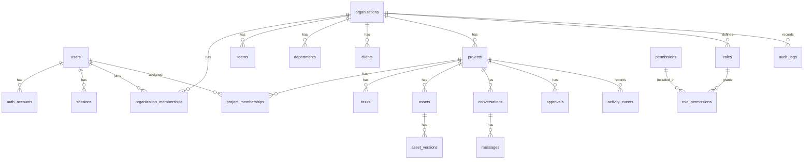

# Database

## Status

Accepted planning baseline. The identity table group (`users`, `auth_accounts`,
`sessions`, `email_verification_tokens`, `password_reset_tokens`) is
implemented per ADR 0019; the `organizations`/`roles`/
`organization_memberships` subset of the "Organizations and access" group is
implemented per ADR 0020; `tasks`/`conversations`/`messages` (a simplified,
single-assignee/no-membership-table version of the planned Collaboration
group) are implemented per ADR 0021; and `projects`/`clients`/
`project_clients` (the "Production structure" group, minus `teams`/
`departments`) are implemented per ADR 0022; `notifications` (from the
Collaboration group) is implemented per ADR 0023; and `comments` (from the
Creative production group, scoped to tasks/projects only) is implemented
per ADR 0024 — see "Implemented Tables" below. `permissions`/
`role_permissions`/`project_memberships`, `task_assignees`/
`conversation_members`, `teams`/`departments`, `activity_events`, and all
other groups remain planning only.

`packages/database` (this schema, migrations, and generated Prisma client)
is consumed directly by `apps/web` as of ADR 0037 — the backend that used
to live in a separate `apps/api` (NestJS) was ported into Next.js Route
Handlers and `apps/api` was deleted. Nothing about the schema or
migrations themselves changed; only which app imports this package did.

## Database Stack

- PostgreSQL
- Prisma ORM

See ADR 0002.

## Database Design Principles

- Organization is the primary tenant boundary.
- Organization-owned records must include `organization_id` directly or through
  a required parent relationship.
- Use relational structure when relationships are known.
- Use constraints to protect data integrity.
- Use indexes based on expected query patterns.
- Store large media files outside PostgreSQL and keep metadata plus object
  references in the database.
- Document every migration.
- Do not add tables without documenting ownership, relationships, permissions,
  and indexes.

## Core Entity Groups

Identity:

- `users`
- `auth_accounts`
- `sessions`
- `email_verification_tokens`
- `password_reset_tokens`

Organizations and access:

- `organizations`
- `organization_memberships`
- `roles`
- `permissions`
- `role_permissions`
- `project_memberships`

Production structure:

- `teams`
- `departments`
- `clients`
- `projects`
- `project_clients`

Collaboration:

- `tasks`
- `task_assignees`
- `conversations`
- `conversation_members`
- `messages`
- `notifications`
- `activity_events`

Creative production:

- `assets`
- `asset_versions`
- `comments`
- `approvals`
- `storyboards`
- `moodboards`
- `scripts`
- `shot_lists`
- `call_sheets`
- `equipment`
- `crew_members`
- `locations`

Business operations:

- `budgets`
- `invoices`
- `contracts`

Security and audit:

- `audit_logs`

## Initial Relationship Model

- A `user` can have many `auth_accounts`.
- A `user` can have many `sessions`.
- An `organization` has many `organization_memberships`.
- A `user` joins an `organization` through `organization_memberships`.
- An `organization` has many `teams`, `departments`, `clients`, and `projects`.
- A `project` belongs to one `organization`.
- A `project` can be linked to many `clients`.
- A `project` has many tasks, assets, conversations, comments, approvals, and
  activity events.
- An `asset` belongs to an organization and usually to a project.
- An `asset` has many `asset_versions`.
- A `comment` belongs to a target such as an asset version, task, or project
  discussion.
- An `approval` belongs to a target and records who requested and granted the
  approval.
- An `audit_log` belongs to an organization and records important actions.

## Baseline ER Diagram

## Required Base Columns

Most tables should include:

- `id`
- `created_at`
- `updated_at`

Organization-owned tables should include:

- `organization_id`

Soft deletion should be used only when product, audit, or recovery needs justify
it. If used, document the reason and include:

- `deleted_at`
- `deleted_by_user_id`

## Index Strategy

Expected indexes:

- Foreign keys.
- `organization_id` on tenant-scoped tables.
- Compound indexes for common organization/project queries.
- Unique constraints scoped by organization where names or slugs are local to an
  organization.
- Token lookup hashes for authentication token tables.
- Created-at indexes for audit logs, activity events, messages, and
  notifications.

## Constraints

Expected constraints:

- Required foreign keys for ownership boundaries.
- Unique email normalization for users or auth identities.
- Unique organization membership per user and organization.
- Unique role names within organization scope where custom roles exist.
- Valid enum values for statuses.
- Non-null status fields for workflow entities.

## Row Level Security (Supabase)

Every table has Postgres Row Level Security enabled with **no
policies** (default-deny), added in migration
`20260711090257_enable_row_level_security`. This has no effect on the
API's own queries - Prisma connects as the table-owning role, which
Postgres exempts from RLS regardless of whether it's enabled. It exists
solely to close Supabase's PostgREST auto-REST exposure: any
`public`-schema table without RLS is reachable through Supabase's own
generated REST API using the project's anon key, entirely bypassing this
app's auth and permission checks. This app never uses that API, so
locking every table down with zero policies costs nothing functionally
while closing that path if the anon key is ever exposed.

## Migration History

- `20260708161817_init_identity` — identity tables (ADR 0019).
- `20260708164132_organizations_houses` — organizations/roles/memberships,
  plus `users.name`/`users.active_organization_id` (ADR 0020).
- `20260708165828_tasks_chat` — tasks/conversations/messages (ADR 0021).
- `20260708172602_projects_clients` — projects/clients/project_clients
  (ADR 0022).
- `20260708173903_notifications` — notifications (ADR 0023).
- `20260708211532_comments` — comments (ADR 0024).

Per-table detail is in each table's own "Migration history" line below.

## Implemented Tables

### Table: `users`

Purpose: represents a person, independent of how they authenticate.

Ownership: none (not organization-scoped; a user can belong to many
organizations via `organization_memberships`).

Columns: `id` (cuid), `email` (unique, normalized lowercase), `name`
(required, collected at signup, added per ADR 0020 once the houses feature
needed a display name), `username` (nullable, unique — a stable `@handle`
distinct from the freely-editable `name`, self-service via `PATCH
/api/v1/auth/me`), `avatar_url` (nullable — a public Supabase Storage URL,
set via `POST /api/v1/auth/me/avatar`), `notification_preferences`
(nullable `Json` — an array of `{id, email, push}` per-notification-type
toggles, set via `PATCH /api/v1/auth/me/notification-preferences`),
`email_verified_at` (nullable), `active_organization_id` (nullable, added
per ADR 0020 — the house the user most recently created/joined; switchable
via the `/dashboard` hub and `POST /api/v1/houses/:houseId/activate`, ADR
0040), `last_seen_at` (nullable, added per ADR 0044 — presence's "last
seen" fallback for when a user has no live Realtime connection; kept fresh
by a periodic `POST /api/v1/auth/me/heartbeat` while the app is open, not
on every request), `created_at`, `updated_at`.

Relationships: has many `auth_accounts`, `sessions`, `email_verification_tokens`,
`password_reset_tokens`, `organization_memberships`. Also has many rows
across every later feature table that records a per-user actor (`tasks`
assignees, `messages`/`message_reactions` authors, `comments`,
`crew_profiles`, `calendar_events`/`time_entries`/`bookings` creators,
`house_invitations`/`house_join_requests` sent and handled, `file_entries`
uploads, `drive_connections` rows connected on a house's behalf
(`connected_by_id`), `scripts`, `call_sheets`, `announcements`) — see each
of those tables' own sections.

Indexes: unique indexes on `email` and `username`.

Constraints: `email` unique; `username` unique when set; `name` non-null.

Permissions: a user may only read/update their own record via `/api/v1/auth/me`
(no admin/user-management endpoints exist yet); avatar upload and
notification-preference updates go through the same `/api/v1/auth/me/*`
self-service surface.

Reasoning: kept separate from `auth_accounts` so a user can have multiple login
methods (email now, OAuth later) without changing this table.
`active_organization_id` is a plain nullable column rather than a separate
table since only one "currently active" house per user is meaningful right
now (no concept of per-device or per-session active house). `avatar_url`
stores a plain public URL rather than a `file_entries` reference — avatars
use a small always-public Fylmico-owned Supabase Storage bucket, not the
house's Drive-backed `file_entries`/`drive_connections` model (ADR 0045),
since an avatar has no house/folder context and must render inline without
a signed-URL round trip.
`notification_preferences` is a single `Json` column (an array of per-type
toggles) rather than a separate preferences table, since the type list is
small and fixed client-side.

Migration history: `20260708161817_init_identity` (initial columns);
`name`/`active_organization_id` added in `20260708164132_organizations_houses`;
`username`/`avatar_url` added in `20260712060000_user_profile_username_avatar`;
`notification_preferences` added in `20260712090000_notification_preferences`;
`last_seen_at` added in `20260714200000_conversation_reads_and_presence`.

### Table: `auth_accounts`

Purpose: represents a login method for a user — email+password and Google
OAuth today (per ADR 0035), both reusing this same table without a schema
change.

Ownership: belongs to one `user`.

Columns: `id`, `user_id`, `provider` (`"email"` or `"google"`),
`provider_account_id` (normalized email for the `email` provider, Google's
`sub` claim for the `google` provider), `password_hash` (nullable — only set
for the `email` provider), `created_at`, `updated_at`.

Relationships: belongs to `users` (cascade delete).

Indexes: unique compound index on `(provider, provider_account_id)`; index on
`user_id`.

Constraints: `(provider, provider_account_id)` unique — enforces one email
account per address, and one Google account per Google `sub`. A user signing
in with Google using an email that already has an `"email"`-provider account
gets a second `auth_accounts` row linked to the same `user_id`, not a
duplicate user (see ADR 0035).

Permissions: managed only through auth endpoints (signup, login, reset-password);
never exposed directly.

Reasoning: separating login methods from `users` is what lets OAuth get added
later (ADR 0003) without a `users` schema change.

Migration history: `20260708161817_init_identity`.

### Table: `sessions`

Purpose: represents an active authenticated session (one per issued
refresh-token lineage).

Ownership: belongs to one `user`.

Columns: `id`, `user_id`, `refresh_token_hash` (unique, sha256 of the opaque
refresh token — never the plaintext token), `user_agent` (nullable),
`ip_address` (nullable), `expires_at`, `revoked_at` (nullable), `created_at`.

Relationships: belongs to `users` (cascade delete).

Indexes: unique index on `refresh_token_hash` (this is also the lookup path
for `/api/v1/auth/refresh`); index on `user_id`.

Constraints: `refresh_token_hash` unique.

Permissions: a session can only be revoked by its owning user, via
`/api/v1/auth/logout` (current session) or `/api/v1/auth/logout-all` (all
sessions).

Reasoning: refresh tokens are rotated in place on each `/api/v1/auth/refresh`
call by updating this row's `refresh_token_hash`/`expires_at` rather than
creating a new row per rotation, per ADR 0019.

Migration history: `20260708161817_init_identity`.

### Table: `email_verification_tokens`

Purpose: single-use codes proving control of an email address. **As of ADR
0039 these are no longer globally-unique opaque link-tokens** — this table
was redesigned to hold short-lived per-user 6-digit OTP codes (e.g. sent by
email and typed into a verification form), not a hash embedded in a
clickable link. Because a 6-digit code space is small, the same code can
legitimately be issued to different users at different times, so
`token_hash` is no longer globally unique — uniqueness/lookup is scoped to
`user_id` instead, and repeated wrong guesses are tracked and locked out via
`attempts`.

Ownership: belongs to one `user`.

Columns: `id`, `user_id`, `token_hash` (sha256 of the 6-digit OTP code —
**not unique**, see Reasoning), `attempts` (`Int`, default `0` — incremented
on each failed verification attempt against this code, added per ADR 0039
to lock a code out after repeated guesses), `expires_at`, `consumed_at`
(nullable), `created_at`.

Relationships: belongs to `users` (cascade delete).

Indexes: index on `user_id` (the lookup path — a code is verified by
looking up the requesting user's active token row, then comparing the
submitted code's hash and `attempts`, not by looking the hash up globally).

Constraints: none beyond the required `user_id` foreign key —
`token_hash`'s global uniqueness constraint was dropped in
`20260714120000_otp_codes` precisely because OTP codes collide across
users by design.

Permissions: consumed only via `/api/v1/auth/verify-email`; never listed or
exposed otherwise.

Reasoning: no email provider is chosen yet (ADR 0019), so the plaintext code
is logged server-side rather than emailed — a temporary stand-in, not the
final delivery mechanism. Switching from link-tokens to OTP codes (ADR 0039)
trades a slightly weaker per-guess brute-force surface (mitigated by
`attempts` locking a code out) for a verification flow that works entirely
within the app UI, with no dependency on the user opening a link from their
email client.

Migration history: `20260708161817_init_identity` (initial link-token
columns); `attempts` added and `token_hash`'s unique constraint dropped in
`20260714120000_otp_codes` (link-token → OTP redesign, ADR 0039).

### Table: `password_reset_tokens`

Purpose: single-use codes authorizing a password reset. **As of ADR 0039
these are no longer globally-unique opaque link-tokens** — same redesign as
`email_verification_tokens` above: this table now holds short-lived
per-user 6-digit OTP codes, with `token_hash` scoped to `user_id` rather
than globally unique, and `attempts` tracking failed guesses.

Ownership: belongs to one `user`.

Columns: `id`, `user_id`, `token_hash` (sha256 of the 6-digit OTP code —
**not unique**, see Reasoning), `attempts` (`Int`, default `0` —
incremented on each failed reset attempt against this code, added per ADR
0039), `expires_at`, `consumed_at` (nullable), `created_at`.

Relationships: belongs to `users` (cascade delete).

Indexes: index on `user_id` (the lookup path, same as
`email_verification_tokens`).

Constraints: none beyond the required `user_id` foreign key —
`token_hash`'s global uniqueness constraint was dropped in
`20260714120000_otp_codes`, same reasoning as
`email_verification_tokens`.

Permissions: consumed only via `/api/v1/auth/reset-password`;
`/api/v1/auth/request-password-reset` always responds identically whether or
not the email is registered, to avoid leaking account existence.

Reasoning: successfully resetting a password also revokes all of that user's
existing sessions (ADR 0019), since a reset implies the old password (and any
session established under it) should no longer be trusted. See
`email_verification_tokens` above for why this moved from link-tokens to
OTP codes (ADR 0039).

Migration history: `20260708161817_init_identity` (initial link-token
columns); `attempts` added and `token_hash`'s unique constraint dropped in
`20260714120000_otp_codes` (link-token → OTP redesign, ADR 0039).

### Table: `organizations`

Purpose: the tenant boundary (ADR 0011), product-facing as a "House."

Ownership: none (top-level; owns `roles` and `organization_memberships`).

Columns: `id`, `name`, `handle` (unique, lowercase URL-safe), `description`,
`invite_code` (unique, format `{HANDLE_PREFIX}-{4 digits}`), `created_at`,
`updated_at`.

Relationships: has many `roles`, `organization_memberships`.

Indexes: unique indexes on `handle` and `invite_code`.

Constraints: `handle` and `invite_code` unique.

Permissions: created by any authenticated user
(`POST /api/v1/houses`); joined via `invite_code`
(`POST /api/v1/houses/join`). No update/delete endpoint exists yet.

Reasoning: `invite_code` is a single code per organization (not per role) in
this pass — see ADR 0020 for why joining defaults to a generic `"Member"`
role rather than a role the invite code itself specifies.

Migration history: `20260708164132_organizations_houses`.

### Table: `roles`

Purpose: an organization-scoped label (name/color/description) — "who has
which crew role" in the UI. Does not yet carry granular permission grants
(see ADR 0020/0004 — `permissions`/`role_permissions` are deferred).

Ownership: belongs to one `organization`.

Columns: `id`, `organization_id`, `name`, `color`, `description`, `created_at`.

Relationships: belongs to `organizations` (cascade delete); has many
`organization_memberships`.

Indexes: unique compound index on `(organization_id, name)`; index on
`organization_id`.

Constraints: `(organization_id, name)` unique — role names are unique within
a house, not globally.

Permissions: the 5 default roles (Owner/Producer/Editor/Videographer/
Photographer) are seeded automatically at house creation; `"Member"` is
seeded lazily on first invite-code join. No endpoint to create/edit custom
roles exists yet.

Reasoning: seeded role names/colors/descriptions match
`apps/web/src/services/base-workspace.service.ts`'s `defaultRoles` exactly,
so the real API's house-creation response is indistinguishable in shape from
what the frontend's mock already returns.

Migration history: `20260708164132_organizations_houses`.

### Table: `organization_memberships`

Purpose: links a user to an organization with a role — the actual
"membership" record.

Ownership: belongs to one `organization` and one `user`.

Columns: `id`, `organization_id`, `user_id`, `role_id`, `created_at`.

Relationships: belongs to `organizations` and `users` (both cascade delete);
belongs to `roles` (no cascade — a role should not disappear out from under
a membership; roles aren't deletable via any endpoint yet anyway).

Indexes: unique compound index on `(organization_id, user_id)`; indexes on
`organization_id` and `user_id`.

Constraints: `(organization_id, user_id)` unique — one membership per user
per house, matching ADR 0011's model.

Permissions: created by house creation (creator, `"Owner"` role),
`POST /api/v1/houses/join` (joiner, `"Member"` role), or
`POST /api/v1/invitations/:token/accept` (invitee, `"Member"` role, per ADR
0036). Removed by `DELETE /api/v1/houses/:houseId/crew/:userId` (another
member removing someone, ADR 0028) or `POST /api/v1/houses/:houseId/leave`
(a member removing themself, ADR 0036) — both refuse to remove the
house's last remaining membership. No endpoint to change a member's role
exists yet.

Reasoning: `HouseMember.status` (online/away/offline) in the API response is
computed at read time (`"online"` for the requesting user, `"offline"` for
everyone else), not stored here — real presence belongs to the realtime
system (ADR 0005), not this table.

Migration history: `20260708164132_organizations_houses`.

### Table: `house_invitations`

Purpose: a targeted, revocable invitation for one specific email address to
join one specific house — distinct from `organizations.invite_code`, which
is a single permanent code anyone can use.

Ownership: belongs to one `organization`; references the inviting `user`
and, once accepted, the accepting `user`.

Columns: `id`, `organization_id`, `email`, `token_hash` (unique — same
opaque-token-hashed-server-side pattern as `email_verification_tokens`/
`password_reset_tokens`), `invited_by_id`, `status` (`"pending"` |
`"accepted"` | `"revoked"`, default `"pending"`), `expires_at` (7 days from
creation), `accepted_by_id` (nullable), `accepted_at` (nullable),
`created_at`.

Relationships: belongs to `organizations` (cascade delete); belongs to
`users` via `invited_by_id` (restrict — an inviter's own account can't be
deleted while their invitation history still points at it); belongs to
`users` via `accepted_by_id` (set null — losing the accepting user's
account shouldn't block deleting old invitation rows).

Indexes: unique index on `token_hash`; indexes on `organization_id` and
`email`.

Permissions: created by `POST /api/v1/houses/:houseId/invitations` (any
member of the house); listed by `GET /api/v1/houses/:houseId/invitations`
(pending only); revoked by
`DELETE /api/v1/houses/:houseId/invitations/:invitationId`; accepted by
`POST /api/v1/invitations/:token/accept`, which also creates the resulting
`organization_memberships` row.

Reasoning: unlike `email_verification_tokens`/`password_reset_tokens`, the
plain token is returned once in the creation response (as a full
`inviteUrl`), not only logged server-side — see ADR 0036 for why an invite
link's exposure profile is treated more like the already-plaintext
`invite_code` than like a password-reset credential.

Migration history: `20260711100000_house_invitations`.

### Table: `house_join_requests`

Purpose: a request from a user to join a house by its `handle` ("tag" in
the request's own error copy — "No house exists with that tag"), reviewed
and approved or rejected by the house's `"Owner"` — the requester-initiated
counterpart to `house_invitations`' owner-initiated flow.

Ownership: belongs to one `organization`; references the requesting `user`
and, once reviewed, the responding `user`.

Columns: `id`, `organization_id`, `user_id`, `status` (`"pending"` |
`"approved"` | `"rejected"`, default `"pending"`), `responded_by_id`
(nullable), `responded_at` (nullable), `created_at`.

Relationships: belongs to `organizations` (cascade delete); belongs to
`users` via `user_id` (cascade delete — a join request has no reason to
survive the requester's account being removed); belongs to `users` via
`responded_by_id` (set null — losing the reviewing owner's account
shouldn't block deleting old request rows).

Indexes: unique compound index on `(organization_id, user_id)`; indexes on
`organization_id` and `user_id`.

Constraints: `(organization_id, user_id)` unique — a user has at most one
join-request row per house; re-requesting after a rejection updates that
same row back to `"pending"` rather than inserting a new one, and is
rejected outright while a request is still `"pending"` (`409
request_pending`) or the user is already a member (`409 already_member`).

Permissions: created via `POST /api/v1/houses/join-requests` (any
authenticated user, looked up by house `handle`); listed via `GET
/api/v1/houses/:houseId/join-requests` (pending only) and reviewed via
`PATCH /api/v1/houses/:houseId/join-requests/:requestId` (body: `status:
"approved" | "rejected"`) — both restricted to the house's `"Owner"` role
via `requireOwnerRole`. Approving creates the resulting
`organization_memberships` row; both outcomes notify the requester in-app,
and a new request also notifies the house's owner(s) in-app and by email
(`buildJoinRequestEmail`).

Reasoning: reuses the same plain-string `"pending"/"approved"/"rejected"`
workflow-status pattern as `tasks.status`, `bookings.status`, and
`house_invitations.status` rather than a DB enum type. Owner-only
review matches the same "only owners decide who's in" posture as
`house_invitations`, just for the opposite (requester-initiated) direction.

Migration history: `20260714150000_house_join_requests`.

### Table: `tasks`

Purpose: a single production task scheduled and assigned within a house.

Ownership: belongs to one `organization`.

Columns: `id`, `organization_id`, `conversation_id` (nullable, added per the
`20260712080000_conversation_links` migration — set when a task is created
from within a chat room rather than the standalone Tasks page), `title`,
`project` (plain string label, not
a foreign key - even though a real `projects` table exists as of ADR 0022,
a task's `project` is still freeform text, not a `project_id` FK; see
Reasoning below), `assignee_id`, `role` (plain string, auto-derived from the
assignee's current `roles.name` at create/reassign time as of ADR 0026 - not
a DB foreign key, and no longer a client-supplied field), `due_date` (plain
string, not a real `DATE`/`TIMESTAMP` - the frontend only ever displays it,
never computes against it), `status` (default `"todo"` as of ADR 0026;
`"todo" | "in-progress" | "on-hold" | "done"`, the same vocabulary the
dashboard's task panel and the standalone Tasks page both use), `priority`
(default `"medium"`; `"low" | "medium" | "high"`), `created_at`, `updated_at`.

Relationships: belongs to `organizations` (cascade delete); belongs to
`users` via `assignee_id` (no cascade - a task shouldn't vanish if its
assignee's account is later deleted; that's an unhandled edge case to
revisit if user deletion is ever implemented); belongs to `conversations`
(`onDelete: SetNull` - a task outlives the chat room it was created from).

Indexes: indexes on `organization_id`, `assignee_id`, and `conversation_id`.

Constraints: none beyond required foreign keys.

Permissions: create/update/delete via `POST` / `PATCH` / `DELETE
/api/v1/tasks(/:taskId)` by any member of the task's house (ADR 0021 and
0026 - no finer-grained role check yet); also creatable/listed room-scoped
via `POST`/`GET /api/v1/chat/rooms/:roomId/tasks`, which sets
`conversation_id` to that room.

Reasoning: single `assignee_id` rather than a `task_assignees` join table -
matches what `docs/api.md`'s contract and the mock actually need
(one assignee per task); a many-to-many upgrade is deferred until a real
multi-assignee feature exists (ADR 0021). `project` stays freeform text
rather than becoming a `project_id` FK (ADR 0026) - the Tasks page lets
someone type an ad-hoc project label when creating a task without first
having to create a real `Project` row; linking the two is future work once
task creation flows through a project-picker instead of free text.

Migration history: `20260708165828_tasks_chat`, `20260710170043_task_status_default_todo`
(initial columns); `conversation_id` added in `20260712080000_conversation_links`.

### Table: `conversations`

Purpose: a named, house-wide chat channel (product-facing as part of a
"House" - not a private/DM thread; see `messages` below for why).

Ownership: belongs to one `organization`.

Columns: `id`, `organization_id`, `name`, `topic`, `created_at`.

Relationships: belongs to `organizations` (cascade delete); has many
`messages`; has many `tasks`, `calendar_events`, and `file_entries` (each
via its own optional `conversation_id`, added in
`20260712080000_conversation_links` — a task/event/file created from
within this room).

Indexes: unique compound index on `(organization_id, name)`; index on
`organization_id`.

Constraints: `(organization_id, name)` unique - channel names are unique
within a house.

Permissions: 3 default conversations (`"general"`, `"edit-bay"`,
`"shoot-floor"`) are seeded automatically at house creation, matching the
mock's `defaultChatRooms`. As of ADR 0029, house members can also create
additional conversations via `POST /api/v1/houses/:houseId/conversations`
(rejects a duplicate name within the house with `409 channel_name_taken`,
enforced by the existing unique constraint). Every house member can see
and post to every conversation in their house - there is no
`conversation_members` table yet, so there's no concept of a
private/restricted room, and no direct-message (1:1) capability exists at
all - every conversation is a house-wide group channel.

Reasoning: named "conversations" (matching `docs/database.md`'s original
Collaboration group naming) rather than a new "chat_rooms" table, even
though the frontend/API vocabulary is "ChatRoom" - same
Organization-is-House-at-the-API-layer mapping pattern as ADR 0018/0020,
so the eventual `conversation_members` table (for private/DM threads) can
be added later without a rename.

Migration history: `20260708165828_tasks_chat`.

### Table: `messages`

Purpose: a single chat message within a conversation, optionally a threaded
reply to another message and/or carrying emoji `message_reactions` (see
below).

Ownership: belongs to one `conversation`.

Columns: `id`, `conversation_id`, `author_id`, `parent_message_id`
(nullable, self-referencing — added per the `20260713220000_message_threads_reactions`
migration for one-level-deep threaded replies), `body`, `created_at`,
`edited_at` (nullable, set on edit — `20260715120000_message_edited_at`).

Relationships: belongs to `conversations` (cascade delete); belongs to
`users` via `author_id` (no cascade, same reasoning as `tasks.assignee_id`);
self-relation via `parent_message_id`/`replies` (`"MessageReplies"`, cascade
delete — deleting a message deletes its replies rather than orphaning
them); has many `message_reactions` (cascade delete).

Indexes: indexes on `conversation_id`, `author_id`, and `parent_message_id`.

Constraints: none beyond required foreign keys. `parent_message_id`, when
provided, is validated at the service layer to be an existing message in
the same `conversation_id` (`400 invalid_request`), not a DB constraint.

Permissions: created via
`POST /api/v1/chat/rooms/:roomId/messages` by any member of the room's
house (ADR 0021), optionally with a `parentMessageId` body field to post it
as a reply; broadcasts to the room's Realtime channel on send (ADR 0044).
Older history paginates via `GET /api/v1/chat/rooms/:roomId/messages`
(cursor-based, ADR 0044). Edited via `PATCH /api/v1/messages/:messageId`
(author-only, `403 not_author`/`403 edit_window_expired` otherwise) within
10 minutes of `created_at`, sets `edited_at` and broadcasts `message:edit`
on the same channel. No delete endpoint exists yet.

Reasoning: threading is intentionally shallow — `parent_message_id` points
directly at the message being replied to with no separate "thread root"
concept, matching what the chat UI's designed reply view needs (a flat
list of replies under one message, not nested sub-threads). Each
conversation's eager `messages` include is capped to the most recent 50
(ADR 0044) rather than loading full history on every workspace fetch;
`listMessages` (cursor-paginated) backs "load earlier messages" beyond
that cap.

Migration history: `20260708165828_tasks_chat` (initial columns);
`parent_message_id` added in `20260713220000_message_threads_reactions`;
`edited_at` added in `20260715120000_message_edited_at`.

### Table: `message_reactions`

Purpose: one user's emoji reaction to a message - the data behind the chat
UI's reaction picker/counts.

Ownership: belongs to one `message` and one `user`.

Columns: `id`, `message_id`, `user_id`, `emoji`, `created_at`.

Relationships: belongs to `messages` (cascade delete); belongs to `users`
(cascade delete).

Indexes: unique compound index on `(message_id, user_id, emoji)`; index on
`message_id`.

Constraints: `(message_id, user_id, emoji)` unique — a user can only react
with the same emoji once per message; reacting again with that emoji
removes the reaction instead of erroring (toggle behavior).

Permissions: toggled via `POST /api/v1/messages/:messageId/reactions` (body:
`emoji`) by any member of the message's room's house; `emoji` must be one of
a fixed 6-value allow-list (`👍 ❤️ 😂 🎉 😮 👀`) validated at the service
layer, not a DB constraint. No standalone list/read endpoint - reactions are
returned grouped by emoji (with counts and whether the requesting user
reacted) as part of the room/message payload.

Reasoning: a real table (not a `Json` column on `messages`) so
`(message_id, user_id, emoji)` uniqueness and per-reaction `user_id`
attribution can be enforced by the database rather than read-modify-write
logic on a shared JSON blob, and so a reacting user can be looked up
without deserializing every message's reaction payload.

### Table: `conversation_reads`

Purpose: tracks how far each user has read into each conversation - what
`unreadCount` in the chat API response is actually computed from (it used
to be hardcoded to `0`, see the `messages` table's history above).

Ownership: belongs to one `conversation` and one `user`.

Columns: `id`, `conversation_id`, `user_id`, `last_read_message_id`
(nullable - the last message the user had seen as of `last_read_at`, kept
for potential future use, not currently read back on its own),
`last_read_at` (also doubles as this row's creation time - no separate
`created_at` column).

Relationships: belongs to `conversations` (cascade delete); belongs to
`users` (cascade delete).

Indexes: unique compound index on `(conversation_id, user_id)`; index on
`user_id`.

Constraints: `(conversation_id, user_id)` unique - one read-state row per
user per conversation, upserted rather than inserted repeatedly.

Permissions: upserted via `POST /api/v1/chat/rooms/:roomId/read`, callable
by any member of the room's house; broadcasts a `read` event on the room's
Realtime channel so the sender's client can show a live read tick (ADR
0044). No direct read endpoint - `unreadCount` is derived from this table
and returned as part of the room/workspace payload instead.

Reasoning: a real per-user table rather than a single `last_message_read`
column on `organization_memberships`, since read state is genuinely
per-conversation, not per-house. `unreadCount` compares each conversation's
_currently loaded_ messages (capped to the last 50, see `messages` above)
against `last_read_at` - an approximation if unread count ever exceeds 50
messages since last read, accepted for this pass (ADR 0044).

Migration history: `20260714200000_conversation_reads_and_presence`.

Migration history: `20260713220000_message_threads_reactions`.

### Table: `projects`

Purpose: the primary production workspace inside a house (ADR 0012) — later
modules (assets, schedules, storyboards) will attach to this.

Ownership: belongs to one `organization`.

Columns: `id`, `organization_id`, `name`, `description` (nullable), `type`
(nullable; one of a fixed production-type list validated at the service
layer, e.g. `"Short Film"`, `"Documentary"`), `genre` (nullable freeform
string), `stage` (default `"Development"`; one of `"Development" |
"Pre-Production" | "In Production" | "In Progress" | "Post-Production" |
"On Hold" | "Completed"` - as of ADR 0027), `progress` (`Int`, default `0`,
0-100), `cover_gradient` (nullable, a Tailwind gradient class string),
`cover_icon` (nullable; one of a fixed icon-key list, e.g. `"camera"`,
mapped to a Lucide icon component client-side), `due_date` (nullable
freeform string - same non-real-date choice as `tasks.due_date`),
`team_ids` (`String[]`, Postgres native array of `users.id` values),
`status` (`"active"` | `"archived"`, default `"active"` - archive tracking
only, distinct from the display-facing status derived from `stage`),
`created_at`, `updated_at`.

Relationships: belongs to `organizations` (cascade delete); has many
`project_clients` (linking to `clients`). `team_ids` is **not** a foreign
key or join table - it's a plain array of user ids, validated at the
service layer (every id must be a current member of the project's house)
but with no DB-level referential integrity, so a removed member's id can
silently linger in a project's `team_ids` until the project is next
updated.

Indexes: index on `organization_id`.

Constraints: none beyond required foreign keys - project names are not
unique within a house.

Permissions: created/read/updated/archived via `/api/v1/houses/:houseId/projects`
and `/api/v1/projects/:projectId` routes by any member of the house (ADR
0022 - no project-level membership/visibility restriction yet).

Reasoning: `status` is a plain string rather than an enum type, matching
the same choice made for `tasks.status`/`tasks.priority` - archiving is
modeled as a status value, set via a dedicated
`POST /api/v1/projects/:projectId/archive` action endpoint rather than a
generic `PATCH`. As of ADR 0027, the API's response `status` field is
**not** this column's value - it's computed server-side from `stage` (a
`Development|Pre-Production|In Production -> active`,
`In Progress|Post-Production -> in-progress`, `On Hold -> on-hold`,
`Completed -> completed` mapping) to match the frontend's designed status
vocabulary, while the DB column continues tracking archive state
separately. No `image`/cover-photo upload field exists - no object storage
system exists yet anywhere in the backend, so new projects fall back to
`cover_gradient`/`cover_icon` only.

Migration history: `20260708172602_projects_clients`,
`20260710172256_project_designed_ui_fields`.

### Table: `clients`

Purpose: an external client that can be linked to one or more projects
(ADR 0012).

Ownership: belongs to one `organization`.

Columns: `id`, `organization_id`, `name`, `contact_name` (nullable),
`contact_email` (nullable), `created_at`, `updated_at`.

Relationships: belongs to `organizations` (cascade delete); has many
`project_clients` (linking to `projects`).

Indexes: index on `organization_id`.

Constraints: none beyond required foreign keys - client names are not
unique within a house.

Permissions: created/read/updated via `/api/v1/houses/:houseId/clients`
and `/api/v1/clients/:clientId` routes by any member of the house (ADR
0022).

Reasoning: kept intentionally minimal (no address, billing, or portal
fields) - only what a project needs to display/link a client right now;
extend when a real feature needs more.

Migration history: `20260708172602_projects_clients`.

### Table: `project_clients`

Purpose: many-to-many link between `projects` and `clients` (ADR 0012: "a
project can be linked to many clients").

Ownership: belongs to one `project` and one `client` (both within the same
house - enforced at the service layer, not a DB constraint, since a
project's and a client's `organization_id` living on different rows can't
be compared by a single foreign key or check constraint without a trigger).

Columns: `id`, `project_id`, `client_id`, `created_at`.

Relationships: belongs to `projects` and `clients` (both cascade delete).

Indexes: unique compound index on `(project_id, client_id)`; indexes on
`project_id` and `client_id`.

Constraints: `(project_id, client_id)` unique - a client can only be linked
to the same project once.

Permissions: created via `POST /api/v1/projects/:projectId/clients` by any
member of the project's house. No unlink endpoint exists yet (ADR 0022).

Reasoning: a plain join table with no extra columns - there's no "role of
this client on this project" concept yet, just presence/absence of a link.

Migration history: `20260708172602_projects_clients`.

### Table: `notifications`

Purpose: a message to a user about something that happened (task assigned,
house joined). No realtime delivery yet (ADR 0005 not implemented) - a
client must poll `GET /api/v1/notifications` to see new ones.

Ownership: belongs to one `user` (the recipient).

Columns: `id`, `user_id`, `type` (plain string, e.g. `"task_assigned"`,
`"house_joined"`), `title`, `body`, `read_at` (nullable), `created_at`.

Relationships: belongs to `users` (cascade delete).

Indexes: index on `user_id`.

Constraints: none beyond required foreign keys.

Permissions: created only server-side (no public create endpoint) by
`TasksService.createTask` (notifies the assignee) and
`OrganizationsService.joinHouse` (notifies the house's `"Owner"`
member(s)). Read/marked-read only by the owning user
(`GET /api/v1/notifications`, `POST /api/v1/notifications/:id/read`,
`POST /api/v1/notifications/read-all`).

Reasoning: no polymorphic "related entity" reference (no `relatedType`/
`relatedId`) - notifications don't need `comments`' `commentableType`/
`commentableId` pattern (below) since nothing yet needs to deep-link a
notification back to its source record, just show a message (ADR 0023).

Migration history: `20260708173903_notifications`.

### Table: `comments`

Purpose: a comment on a task or project - resolves the "comment target
modeling strategy" deferred decision (ADR 0024).

Ownership: belongs to one `organization` (denormalized from the target,
matching `tasks`/`messages`' pattern) and one `user` (the author).

Columns: `id`, `organization_id`, `commentable_type` (`"task"` |
`"project"`), `commentable_id`, `author_id`, `body`, `created_at`,
`updated_at`.

Relationships: belongs to `organizations` (cascade delete); belongs to
`users` via `author_id` (no cascade, same reasoning as `tasks.assignee_id`).
No database foreign key on `commentable_id` - it points to either a `tasks`
or a `projects` row depending on `commentable_type`, so validity is
enforced at the service layer (404 checks before create/list), not a DB
constraint.

Indexes: index on `organization_id`; compound index on
`(commentable_type, commentable_id)` (the actual lookup path for listing a
target's comments).

Constraints: none beyond required foreign keys.

Permissions: created/read via `POST`/`GET /api/v1/tasks/:taskId/comments`
and `POST`/`GET /api/v1/projects/:projectId/comments` by any member of the
target's house. No edit/delete endpoint exists yet.

Reasoning: a type+id pair rather than a join table per commentable type
(`task_comments`, `project_comments`) - adding a new commentable type later
(`asset_version`) is a new string value and a thin controller/service pair,
not a schema migration (ADR 0024).

Migration history: `20260708211532_comments`.

### Table: `crew_profiles`

Purpose: production-specific profile data for a house member (department,
availability, current assignment) - the data the Crews page's designed UI
needs but that doesn't belong on the core `User`/`OrganizationMembership`
identity/membership models (ADR 0028).

Ownership: belongs to one `organization` and one `user`; conceptually a
1:1 extension of that pair's `organization_memberships` row (same
`(organization_id, user_id)` uniqueness), not modeled as a literal foreign
key to `organization_memberships` itself.

Columns: `id`, `organization_id`, `user_id`, `job_title`, `department`
(default `"Production"`; one of 7 fixed values, validated at the service
layer), `role_category` (default `"Other"`; one of 6 fixed values),
`status` (default `"available"`; `"available" | "on-set" | "on-leave" |
"unavailable"` - a production-availability status, distinct from
`organizations.toHouseDto`'s unrelated online/away/offline presence
status returned elsewhere), `current_project` (nullable freeform string,
not a `project_id` FK - same reasoning as `tasks.project`), `project_stage`
(nullable freeform string), `availability` (nullable freeform display
string, e.g. `"Jul 7 - Jul 15"` - not a real date range), `birthday`
(nullable freeform `"MM-DD"` string, no year), `created_at`, `updated_at`.

Relationships: belongs to `organizations` (cascade delete); belongs to
`users` (cascade delete - unlike `tasks.assignee_id`/`comments.author_id`,
a crew profile has no reason to survive its user being removed from the
system).

Indexes: index on `organization_id`; unique constraint on
`(organization_id, user_id)`.

Constraints: unique `(organization_id, user_id)` - one profile per member
per house.

Permissions: auto-created (not via a public endpoint) when a user creates
or joins a house (`OrganizationsService.createHouse`/`joinHouse`); read via
`GET /api/v1/houses/:houseId/crew` by any house member; updated via
`PATCH .../crew/:userId` by any house member (no restriction to "only the
profile's own owner may edit it" - matches the app's existing lax
authorization posture); deleted only as a side effect of
`DELETE .../crew/:userId` removing the underlying house membership
entirely (not a standalone delete endpoint).

Reasoning: a separate table rather than adding these columns directly to
`organization_memberships` - keeps identity/membership (who belongs to
which house, with what role) cleanly separate from this page-specific
profile data, and avoids widening the membership table with columns only
the Crews UI cares about. `DELETE .../crew/:userId` is this codebase's
first "remove a member from a house" capability
(`OrganizationsService.removeMember`, ADR 0028) - it refuses to remove a
house's last remaining member, but has no finer-grained permission check
beyond "any current member," so any member can currently remove any other
member including the Owner - a known, documented gap consistent with
every other module's "no RBAC yet" posture.

Migration history: `20260710174050_crew_profiles`.

### Table: `calendar_events`

Purpose: a scheduled event on a house's calendar - the data the Calendar
page's designed UI needs (shoot days, meetings, deliveries) with no prior
backend equivalent (ADR 0030).

Ownership: belongs to one `organization`; optionally belongs to one
`project` (nullable - an event with no project is a "My Schedule" entry)
and/or one `conversation` (nullable - set when the event is created from
within a chat room); records who created it via `created_by_id`.

Columns: `id`, `organization_id`, `project_id` (nullable), `conversation_id`
(nullable, added per the `20260712080000_conversation_links` migration),
`created_by_id`,
`title`, `date` (string, `YYYY-MM-DD` - opaque string like
`tasks.due_date`, not a real `DateTime`), `time` (freeform string, e.g.
`"2:00 PM"` or `"EOD"` - matches the frontend's non-24-hour input, not
validated as a real time value), `location` (nullable), `category`
(default `"other"`; one of 6 fixed values -
`shoot`/`post-production`/`meeting`/`pre-production`/`delivery`/`other` -
validated at the DTO layer), `created_at`, `updated_at`.

Relationships: belongs to `organizations` (cascade delete); belongs to
`projects` (`onDelete: SetNull` - deleting a project keeps its past
calendar events, just detaches them back to "My Schedule" rather than
deleting event history); belongs to `conversations` (`onDelete: SetNull` -
an event outlives the chat room it was created from); belongs to `users`
via `created_by_id` (no cascade rule specified beyond the default
restrict).

Indexes: index on `organization_id`; index on `project_id`; index on
`conversation_id`.

Constraints: none beyond required foreign keys.

Permissions: created/read via `POST`/`GET
/api/v1/houses/:houseId/calendar-events` by any house member; also
creatable/listed room-scoped via `POST`/`GET
/api/v1/chat/rooms/:roomId/events`, which sets `conversation_id` to that
room. No update/delete endpoint yet.

Reasoning: a real "calendar" concept per house isn't a separate table -
"calendars" in the UI are just "My Schedule" (events with `project_id =
null`) plus one entry per real `Project`, so filtering by calendar is
filtering by `project_id`, no additional join table needed (ADR 0030).

Migration history: `20260710221800_calendar_events` (initial columns);
`conversation_id` added in `20260712080000_conversation_links`.

### Table: `time_entries`

Purpose: a logged block of hours a house member spent on work - the real
backing data behind the Analytics page's hours/workload/phase-
distribution panels, none of which had any real data source before this
table existed (ADR 0031).

Ownership: belongs to one `organization`; optionally belongs to one
`project` (nullable - unassigned time still counts toward house-wide
totals); belongs to the `user` who logged it.

Columns: `id`, `organization_id`, `project_id` (nullable), `user_id`,
`phase` (default `"Production"`; one of `Pre-Production`/`Production`/
`Post-Production`/`Planning`, validated at the DTO layer - the same four
phases the Analytics mock's time-distribution chart already used),
`hours` (`Float`, so partial hours like `2.5` are representable), `date`
(string, `YYYY-MM-DD` - opaque string like `tasks.due_date` and
`calendar_events.date`, not a real `DateTime`), `note` (nullable),
`created_at`, `updated_at`.

Relationships: belongs to `organizations` (cascade delete); belongs to
`projects` (`onDelete: SetNull` - deleting a project keeps the logged
hours as house-wide history rather than deleting them); belongs to
`users` (cascade delete).

Indexes: index on `organization_id`; index on `project_id`; index on
`user_id`.

Constraints: none beyond required foreign keys and `hours` being
validated positive at the DTO layer (not a DB-level check constraint).

Permissions: created/read via `POST`/`GET
/api/v1/houses/:houseId/time-entries` by any house member. No
update/delete endpoint yet.

Reasoning: a dedicated table rather than an `hours` column on `Task` -
time is logged per work session (possibly several times a day, possibly
unrelated to any specific task), not once per task, and the Analytics
page's phase/day/project breakdowns need many rows per person, not one.

Migration history: `20260710223849_time_entries`.

### Table: `resources`

Purpose: a bookable physical resource within a house (equipment, a vehicle,
an edit bay) - the thing a `bookings` row reserves time on.

Ownership: belongs to one `organization`.

Columns: `id`, `organization_id`, `name`, `category` (default
`"equipment"`, freeform, validated at the DTO layer), `subtitle`
(nullable), `tag` (nullable), `created_at`.

Relationships: belongs to `organizations` (cascade delete); has many
`bookings`.

Indexes: index on `organization_id`.

Constraints: none beyond required foreign keys - resource names are not
unique within a house at the DB level, though `BookingsService`'s
find-or-create matches an existing resource case-insensitively by name
before creating a new one.

Permissions: no standalone CRUD endpoint - created implicitly the first
time a booking names a resource that doesn't already exist in the house
(`POST /api/v1/houses/:houseId/bookings`).

Reasoning: kept separate from `bookings` so the same physical resource can
be booked more than once over time without repeating its name/category/
subtitle/tag on every booking row; created lazily rather than through a
dedicated "add equipment" flow since the Bookings page's designed UI only
ever creates a resource by naming it inline when booking it.

Migration history: `20260711224500_bookings`.

### Table: `bookings`

Purpose: a reservation of a `resource` for a date/time window, optionally
tied to a `project` - the data behind the Bookings page.

Ownership: belongs to one `organization` and one `resource`; optionally
belongs to one `project`; records who made it via `booked_by_id`.

Columns: `id`, `organization_id`, `resource_id`, `project_id` (nullable),
`start_date`, `end_date`, `start_time`, `end_time` (all plain strings, same
non-real-date/time choice as `tasks.due_date`/`calendar_events.date`/
`time`), `status` (default `"confirmed"` at the schema level, though
`BookingsService.create` always sets it to `"pending"` unless the DTO says
otherwise; `"pending" | "confirmed" | "cancelled"`, validated at the DTO
layer), `booked_by_id`, `notes` (nullable), `created_at`.

Relationships: belongs to `organizations` (cascade delete); belongs to
`resources` (cascade delete - a booking has no meaning once its resource is
gone); belongs to `projects` (`onDelete: SetNull`, same reasoning as
`calendar_events.project_id`); belongs to `users` via `booked_by_id` (no
cascade, same reasoning as `tasks.assignee_id`).

Indexes: indexes on `organization_id`, `resource_id`, and `project_id`.

Constraints: none beyond required foreign keys.

Permissions: created via `POST /api/v1/houses/:houseId/bookings` and listed
via `GET /api/v1/houses/:houseId/bookings` by any house member (creating a
booking notifies the house's `"Owner"` member(s)); status updated via
`PATCH /api/v1/bookings/:bookingId`, restricted to the `"Owner"` role
(`requireOwnerRole`) and notifies the original booker when the status
changes away from `"pending"`.

Reasoning: a new booking defaults to `"pending"` (owner approval required)
rather than `"confirmed"`, distinguishing a request from an approved
reservation - the same requester/owner-approval shape as
`house_join_requests`, just for equipment instead of house membership.

Migration history: `20260711224500_bookings`.

### Table: `boards`

Purpose: a storyboard - an ordered sequence of `shots` for a project or
script, the data behind the Storyboard page.

Ownership: belongs to one `organization`; optionally belongs to one
`project` and/or one `script`.

Columns: `id`, `organization_id`, `project_id` (nullable), `script_id`
(nullable, added once `scripts` existed), `name`, `description` (nullable),
`created_at`, `updated_at`.

Relationships: belongs to `organizations` (cascade delete); belongs to
`projects` (`onDelete: SetNull`, same reasoning as
`calendar_events.project_id`); belongs to `scripts` (`onDelete: SetNull` -
a board can reference the script it's boarding out, but outlives that
script being deleted); has many `shots`.

Indexes: indexes on `organization_id`, `project_id`, and `script_id`.

Constraints: none beyond required foreign keys - board names are not
unique within a house.

Permissions: created/listed via `POST`/`GET
/api/v1/houses/:houseId/boards` by any house member (creation can seed an
initial batch of `shots` in the same request); updated/deleted via
`PATCH`/`DELETE /api/v1/houses/:houseId/boards/:boardId` by any house
member.

Reasoning: a board's `updated_at` is bumped whenever one of its `shots` is
added (`StoryboardService.createShot`), even though the shot itself is a
separate row - keeps the boards list's "last updated" sort meaningful
without joining through `shots` at query time.

Migration history: `20260711231500_storyboard` (initial columns);
`script_id` added in `20260712160000_scripts`.

### Table: `shots`

Purpose: a single storyboard panel within a `board`.

Ownership: belongs to one `board`.

Columns: `id`, `board_id`, `order` (`Int`, default `0`), `description`,
`camera_angle` (nullable), `notes` (nullable), `image_url` (nullable),
`created_at`, `updated_at`.

Relationships: belongs to `boards` (cascade delete).

Indexes: index on `board_id`.

Constraints: none beyond required foreign keys - `order` is a plain `Int`
maintained by the service layer (new shots default to one past the current
max), not a DB-enforced sequence or unique-per-board constraint.

Permissions: created via `POST
/api/v1/houses/:houseId/boards/:boardId/shots`; updated via `PATCH
/api/v1/houses/:houseId/shots/:shotId` - both by any house member. No
delete or reorder endpoint exists yet.

Reasoning: `image_url` is a plain nullable string, not a `file_entries`
link - shot images aren't modeled as house files with an uploader/Drive
backing, just a URL the client sets directly.

Migration history: `20260711231500_storyboard`.

### Table: `characters`

Purpose: a character in a project's story - a Storyboard-adjacent reference
list, not tied to any specific board/shot.

Ownership: belongs to one `organization`; optionally belongs to one
`project`.

Columns: `id`, `organization_id`, `project_id` (nullable), `name`, `role`
(freeform, e.g. `"Protagonist"`), `description` (nullable), `created_at`,
`updated_at`.

Relationships: belongs to `organizations` (cascade delete); belongs to
`projects` (`onDelete: SetNull`, same reasoning as `boards.project_id`).

Indexes: indexes on `organization_id` and `project_id`.

Constraints: none beyond required foreign keys - character names are not
unique within a house or project.

Permissions: created/listed via `POST`/`GET
/api/v1/houses/:houseId/characters`; deleted via `DELETE
/api/v1/houses/:houseId/characters/:characterId` - both by any house
member. No update endpoint exists yet.

Reasoning: added later than `boards`/`shots` as a separate flat reference
table rather than a column on `shots` - a character is referenced across
many shots/boards, not owned by any single one.

Migration history: `20260712070000_storyboard_characters_locations`.

### Table: `story_locations`

Purpose: a shooting location referenced by a project's story - `shot_count`
mirrors how many shots are tagged to it in the designed UI.

Ownership: belongs to one `organization`; optionally belongs to one
`project`.

Columns: `id`, `organization_id`, `project_id` (nullable), `name`, `type`
(freeform, e.g. `"Interior"`/`"Exterior"`), `shot_count` (`Int`, default
`0`), `created_at`, `updated_at`.

Relationships: belongs to `organizations` (cascade delete); belongs to
`projects` (`onDelete: SetNull`, same reasoning as `characters.project_id`).

Indexes: indexes on `organization_id` and `project_id`.

Constraints: none beyond required foreign keys.

Permissions: created/listed via `POST`/`GET
/api/v1/houses/:houseId/locations`; deleted via `DELETE
/api/v1/houses/:houseId/locations/:locationId` - both by any house member.
No update endpoint exists yet.

Reasoning: `shot_count` is a plain stored `Int` rather than computed from a
real `shots.location_id` foreign key - shots don't reference a location at
all yet, so this column is a manually-tracked placeholder count, not a
live aggregate (a known gap to revisit once shots gain a real location
link).

Migration history: `20260712070000_storyboard_characters_locations`.

### Table: `scripts`

Purpose: a screenplay/script document - free-text `content`, the data
behind the Scripts module.

Ownership: belongs to one `organization`; optionally belongs to one
`project`; records who created it via `created_by_id`.

Columns: `id`, `organization_id`, `project_id` (nullable), `title`,
`content` (default `""` - the full script body, freeform text),
`created_by_id`, `created_at`, `updated_at`.

Relationships: belongs to `organizations` (cascade delete); belongs to
`projects` (`onDelete: SetNull`, same reasoning as `boards.project_id`);
belongs to `users` via `created_by_id` (no cascade, same reasoning as
`tasks.assignee_id`); has many `boards` (a board can reference the script
it's boarding out via `boards.script_id`).

Indexes: indexes on `organization_id` and `project_id`.

Constraints: none beyond required foreign keys - script titles are not
unique within a house.

Permissions: created/listed via `POST`/`GET
/api/v1/houses/:houseId/scripts`; read/updated/deleted via `GET`/`PATCH`/
`DELETE /api/v1/houses/:houseId/scripts/:scriptId` - all by any house
member. No edit-locking or version history exists yet.

Reasoning: `content` is a single `String` column (whole-document overwrite
on every update) rather than a versioned/paragraph-level structure - matches
the module's current scope (a single collaborative text blob), with a
`wordCount` computed at read time from `content.split(/\s+/)` rather than
stored.

Migration history: `20260712160000_scripts`.

### Table: `file_entries`

Purpose: the house-wide file/folder tree (files and folders), the data
behind the Files page - a shared index/tree over files whose actual bytes
live in the house's single connected Google Drive (ADR 0045).

Ownership: belongs to one `organization`; optionally belongs to a parent
`file_entries` row (folder nesting) and/or a `conversation` (a file
attached from within a chat room); records who uploaded/created it via
`uploaded_by_id`.

Columns: `id`, `organization_id`, `parent_id` (nullable, self-referencing),
`conversation_id` (nullable), `name`, `type` (`"file"` | `"folder"`),
`storage_path` (nullable - the Google Drive object id, for both `"file"`
and `"folder"` rows now that there's one house Drive), `drive_key`
(nullable, unique per `organization_id` - a stable identifier for
system-managed folders, e.g. `"clients"`, `"client:<id>"`,
`"project:<id>:Raw Data"`; `null` for ad-hoc user-created folders/files),
`sensitive` (`Boolean`, default `false` - gates visibility to Owners only),
`size` (nullable `Int`, bytes), `mime_type` (nullable), `uploaded_by_id`,
`created_at`, `updated_at`.

Relationships: belongs to `organizations` (cascade delete); self-relation
via `parent_id`/`children` (`"FileEntryChildren"`, cascade delete -
deleting a folder deletes its contents); belongs to `users` via
`uploaded_by_id` (no cascade, same reasoning as `tasks.assignee_id`);
belongs to `conversations` (`onDelete: SetNull` - a file outlives the chat
room it was attached from).

Indexes: indexes on `organization_id`, `parent_id`, and `conversation_id`;
unique compound index on `(organization_id, drive_key)`.

Constraints: `(organization_id, drive_key)` unique (`NULL` values don't
constrain each other, so ad-hoc folders/files are unaffected).

Permissions: listed via `GET /api/v1/houses/:houseId/files` (a `sensitive`
query param switches to the Owner-only Sensitive tree, enforced
server-side); created (folders and file uploads) via `POST` on the same
path and `POST /api/v1/houses/:houseId/files/upload`; a destination for an
upload can be resolved first via `POST
/api/v1/houses/:houseId/files/resolve-destination` (client/project or
Misc, plus a category); deleted via `DELETE
/api/v1/houses/:houseId/files/:entryId` (refuses entries with a non-null
`drive_key` - system-managed folders can't be deleted through the app);
copied into the Portfolio via `POST
/api/v1/houses/:houseId/files/:entryId/add-to-portfolio` (a second row
pointing at the same `storage_path`, no re-upload); usage summary via `GET
/api/v1/houses/:houseId/files/summary` - all by any house member except
the Sensitive-tree paths, which require the Owner role. Chat rooms can
also list/attach files scoped to their `conversation_id` via `GET`/`POST
/api/v1/chat/rooms/:roomId/files`. Downloads are served via a short-lived
signed token (`GET /api/v1/files/download/:token`), not a direct Drive
URL.

Reasoning: no object storage of its own - `storage_path` is a Google Drive
object id, not a bucket key (distinct from `users.avatar_url`, which uses
a small Fylmico-owned Supabase Storage bucket for avatars specifically).
Since ADR 0045 moved to one Drive per house, every entry now maps 1:1 to
one Drive object - the per-uploader mirror cache ADR 0038 needed
(`drive_folder_links`) no longer exists.

Migration history: `20260711234500_file_entries` (initial columns);
`conversation_id` added in `20260712080000_conversation_links`; `drive_key`
and `sensitive` added in `20260715150000_house_drive_connection` (ADR
0045), which also dropped `drive_folder_links`.

### Table: `drive_connections`

Purpose: a house's single Google Drive OAuth connection, authorized by
the Owner - Fylmico automatically creates and maintains the entire folder
structure inside it (ADR 0045).

Ownership: belongs to one `organization` (1:1); records who authorized it
via `connected_by_id`.

Columns: `id`, `organization_id` (unique), `connected_by_id`,
`refresh_token`, `google_email` (nullable), `visible_root_folder_id` (Drive
id of the "FYLMICO House" root), `sensitive_root_folder_id` (Drive id of
the "FYLMICO House (Sensitive)" root), `created_at`, `updated_at`.

Relationships: belongs to `organizations` (cascade delete); belongs to
`users` via `connected_by_id` (restrict delete - a connection can't be
orphaned by deleting its connecting user, matching `assignee_id`-style FKs
elsewhere).

Indexes: unique index on `organization_id`.

Constraints: `organization_id` unique - one Drive connection per house.

Permissions: created via the OAuth flow (`GET
/api/v1/houses/:houseId/drive/connect-url` to start it, `GET
/api/v1/drive/callback` to complete it - the callback path itself stays
flat/unparameterized since it's the registered Google redirect URI;
`organizationId` travels inside the signed state token instead, see
`drive-token.util.ts`) - both Owner-only (`requireOwnerRole`); checked via
`GET /api/v1/houses/:houseId/drive/status` (any member); removed via
`DELETE /api/v1/houses/:houseId/drive/disconnect` (Owner-only - also wipes
every `file_entries` row with a non-null `drive_key` for that house).

Reasoning: `refresh_token` is stored in plaintext in this pass (no
encryption-at-rest layer exists yet anywhere in this schema) - a known gap
consistent with this codebase's general "no encryption beyond password/
token hashing" posture; access tokens themselves are never stored, only
refreshed on demand from `refresh_token` (`DriveService.getValidAccessToken`).
Per-user `DriveConnection` (ADR 0038) was deliberately reversed here - see
ADR 0045 for the tradeoff (a single shared connection is now a single
point of failure for the whole house, accepted as the explicit product
requirement).

Migration history: `20260712150000_drive_connections` (original per-user
shape); reshaped to per-house in `20260715150000_house_drive_connection`
(ADR 0045) - existing per-user rows were truncated as a breaking change,
see that ADR's Costs section.

### Table: `call_sheets`

Purpose: a single shoot day's call sheet (crew call times, location,
weather, notes) - the data behind the Call Sheets module.

Ownership: belongs to one `organization`; optionally belongs to one
`project`; records who created it via `created_by_id`.

Columns: `id`, `organization_id`, `project_id` (nullable), `title`,
`shoot_date` (plain string, same non-real-date choice as `tasks.due_date`),
`general_call_time` (plain string), `location` (nullable), `weather`
(nullable), `notes` (nullable), `crew_call_times` (`Json` - an array of
`{userId, name, jobTitle, callTime}` entries), `created_by_id`,
`created_at`, `updated_at`.

Relationships: belongs to `organizations` (cascade delete); belongs to
`projects` (`onDelete: SetNull`, same reasoning as `boards.project_id`);
belongs to `users` via `created_by_id` (no cascade, same reasoning as
`tasks.assignee_id`).

Indexes: indexes on `organization_id` and `project_id`.

Constraints: none beyond required foreign keys - `project_id`, when
provided, is validated at the service layer to belong to the same house
(`400 invalid_request`), not a DB constraint.

Permissions: created/listed via `POST`/`GET
/api/v1/houses/:houseId/call-sheets`; read/updated/deleted via `GET`/
`PATCH`/`DELETE /api/v1/call-sheets/:callSheetId` - all by any house
member.

Reasoning: `crew_call_times` is a single denormalized `Json` array (each
entry snapshotting a crew member's name/job title/call time at the moment
the call sheet was written) rather than a join table to
`organization_memberships` - a call sheet is a point-in-time printed/shared
document, so it shouldn't silently change if a crew member's job title is
later edited.

Migration history: `20260713221000_call_sheets`.

### Table: `announcements`

Purpose: a house-wide announcement, optionally pinned - the data behind the
Announcements module.

Ownership: belongs to one `organization`; records who posted it via
`author_id`.

Columns: `id`, `organization_id`, `author_id`, `title`, `body`, `pinned`
(`Boolean`, default `false`), `created_at`, `updated_at`.

Relationships: belongs to `organizations` (cascade delete); belongs to
`users` via `author_id` (no cascade, same reasoning as `tasks.assignee_id`).

Indexes: index on `organization_id`.

Constraints: none beyond required foreign keys.

Permissions: listed via `GET /api/v1/houses/:houseId/announcements` by any
house member (pinned first, then newest first); created via `POST
/api/v1/houses/:houseId/announcements`; updated/deleted via `PATCH`/
`DELETE /api/v1/announcements/:announcementId` - all restricted to the
house's `"Owner"` role (`requireOwnerRole`). Posting one notifies every
other house member in-app.

Reasoning: only owners can post/edit/delete - unlike most other modules in
this schema (tasks, comments, booking creation, etc.), which allow any
member, an announcement is a broadcast to the whole house, matching the
same owner-only posture already established for reviewing
`house_join_requests` and `bookings` status changes.

Migration history: `20260713222000_announcements`.

## Table Documentation Template

Use this template for every table once schema work begins.

### Table: `table_name`

Purpose:

Ownership:

Columns:

Relationships:

Indexes:

Constraints:

Permissions:

Reasoning:

Migration history:

## Deferred Database Decisions

- Granular permission grants (`permissions`/`role_permissions` tables) — the
  `roles` table implemented per ADR 0020 is a label only (name/color/
  description), not yet tied to `resource.action` grants.
- Audit log payload shape.
- Asset storage provider metadata — resolved for house files via
  `file_entries`/`drive_connections` (ADR 0045, Google-Drive-backed, one
  connection per house); avatars separately use a small Fylmico-owned
  Supabase Storage bucket. No equivalent exists yet for a dedicated,
  versioned "assets" module (see the Creative production group above —
  `assets`/`asset_versions` remain planning only).
- Search indexing strategy.
- Billing and subscription tables.
