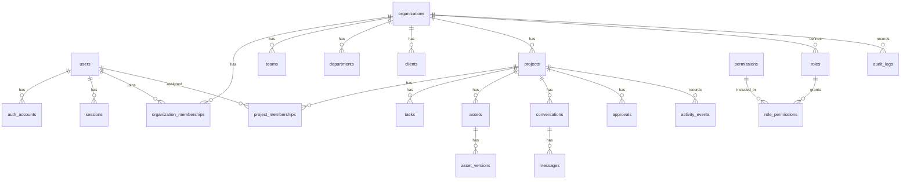

# Database

## Status

Accepted planning baseline. No database schema, migrations, or tables have been
created.

## Database Stack

- PostgreSQL
- Prisma ORM

See ADR 0002.

## Database Design Principles

- Organization is the primary tenant boundary.
- Organization-owned records must include `organization_id` directly or through
  a required parent relationship.
- Use relational structure when relationships are known.
- Use constraints to protect data integrity.
- Use indexes based on expected query patterns.
- Store large media files outside PostgreSQL and keep metadata plus object
  references in the database.
- Document every migration.
- Do not add tables without documenting ownership, relationships, permissions,
  and indexes.

## Core Entity Groups

Identity:

- `users`
- `auth_accounts`
- `sessions`
- `email_verification_tokens`
- `password_reset_tokens`

Organizations and access:

- `organizations`
- `organization_memberships`
- `roles`
- `permissions`
- `role_permissions`
- `project_memberships`

Production structure:

- `teams`
- `departments`
- `clients`
- `projects`
- `project_clients`

Collaboration:

- `tasks`
- `task_assignees`
- `conversations`
- `conversation_members`
- `messages`
- `notifications`
- `activity_events`

Creative production:

- `assets`
- `asset_versions`
- `comments`
- `approvals`
- `storyboards`
- `moodboards`
- `scripts`
- `shot_lists`
- `call_sheets`
- `equipment`
- `crew_members`
- `locations`

Business operations:

- `budgets`
- `invoices`
- `contracts`

Security and audit:

- `audit_logs`

## Initial Relationship Model

- A `user` can have many `auth_accounts`.
- A `user` can have many `sessions`.
- An `organization` has many `organization_memberships`.
- A `user` joins an `organization` through `organization_memberships`.
- An `organization` has many `teams`, `departments`, `clients`, and `projects`.
- A `project` belongs to one `organization`.
- A `project` can be linked to many `clients`.
- A `project` has many tasks, assets, conversations, comments, approvals, and
  activity events.
- An `asset` belongs to an organization and usually to a project.
- An `asset` has many `asset_versions`.
- A `comment` belongs to a target such as an asset version, task, or project
  discussion.
- An `approval` belongs to a target and records who requested and granted the
  approval.
- An `audit_log` belongs to an organization and records important actions.

## Baseline ER Diagram

## Required Base Columns

Most tables should include:

- `id`
- `created_at`
- `updated_at`

Organization-owned tables should include:

- `organization_id`

Soft deletion should be used only when product, audit, or recovery needs justify
it. If used, document the reason and include:

- `deleted_at`
- `deleted_by_user_id`

## Index Strategy

Expected indexes:

- Foreign keys.
- `organization_id` on tenant-scoped tables.
- Compound indexes for common organization/project queries.
- Unique constraints scoped by organization where names or slugs are local to an
  organization.
- Token lookup hashes for authentication token tables.
- Created-at indexes for audit logs, activity events, messages, and
  notifications.

## Constraints

Expected constraints:

- Required foreign keys for ownership boundaries.
- Unique email normalization for users or auth identities.
- Unique organization membership per user and organization.
- Unique role names within organization scope where custom roles exist.
- Valid enum values for statuses.
- Non-null status fields for workflow entities.

## Migration History

No migrations exist yet.

## Table Documentation Template

Use this template for every table once schema work begins.

### Table: `table_name`

Purpose:

Ownership:

Columns:

Relationships:

Indexes:

Constraints:

Permissions:

Reasoning:

Migration history:

## Deferred Database Decisions

- Exact custom role schema.
- Audit log payload shape.
- Comment target modeling strategy.
- Asset storage provider metadata.
- Search indexing strategy.
- Billing and subscription tables.
